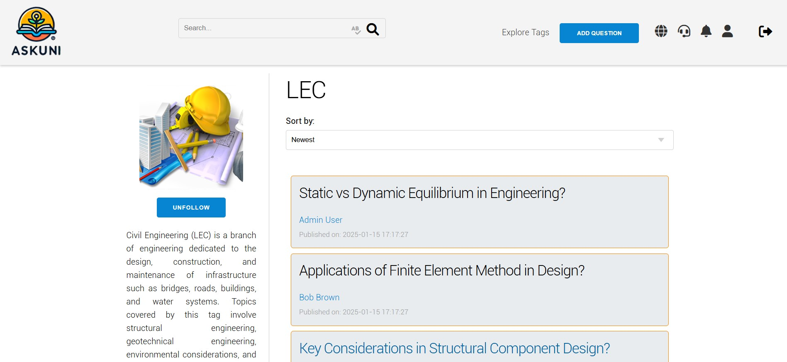

# AskUni

## Description
This project is a Q&A platform aimed at students and professionals of FEUP. It allows users to ask questions, answer questions, follow topics of interest, and collaborate with the community.

## Project Components

- [ER: Requirements Specification Component](WIKI/ER.md)
- [EBD: Database Specification Component](WIKI/EBD.md)
- [EAP: Architecture Specification and Prototype](WIKI/EAP.md)
- [PA: Product and Presentation](WIKI/PA.md)

### Features
- Q&A system
- Tag system for content organization
- Reputation system with points and badges
- Follow questions to receive updates
- Edit history to maintain content quality
- Support system with tickets
- User profiles to showcase expertise and contributions
- Efficient search function
- Global chat for real-time communication


### Screenshots





## Installation
To install the project, follow the steps below:

1. Clone the repository:
    ```bash
    git clone https://gitlab.up.pt/lbaw/lbaw2425/lbaw24153.git
    ```
2. Navigate to the project directory:
    ```bash
    cd lbaw24153
    ```
3. Install the dependencies:
    ```bash
    composer install
    ```
4. Configure the `.env` file:
    ```bash
    cp .env.example .env
    ```
5. Start the server:
    ```bash
    php artisan serve
    ```

### Requirements
- PHP >= 8.3
- Composer >= 2.2

## Usage

### Using the production Image

To use the production imagem you should use the following command (only works in FEUP's network):

```bash
docker run -d --name lbaw24153 -p 8001:80 gitlab.up.pt:5050/lbaw/lbaw2425/lbaw24153
```

To get started, you can use the accounts provided below, or you can create your own account.

| Type          | Email  | Password |
| ------------- | --------- | -------- |
| Administrator | admin_user@fe.up.pt    | hashed_password_admin |
| Moderator | jane_smith@fe.up.pt  | hashed_password_2 |
| Regular User   | alice_jones@fe.up.pt   | hashed_password_3 |
| Blocked User| john_doe@fe.up.pt|1234|

## Support
For support, you can send an email to any of these addresses:

* up202206280@up.pt
* up202208726@up.pt
* up202204883@up.pt

## Roadmap
- Add support for multiple languages
- Implement real-time notifications
- Improve user interface
- Add social media integration

## Contributing
We welcome contributions! To contribute, follow the steps below:

1. Fork the project
2. Create a new branch:
    ```bash
    git checkout -b feature/new-feature
    ```
3. Make your changes and commit:
    ```bash
    git commit -m 'Add new feature'
    ```
4. Push your changes:
    ```bash
    git push origin feature/new-feature
    ```
5. Open a Pull Request
