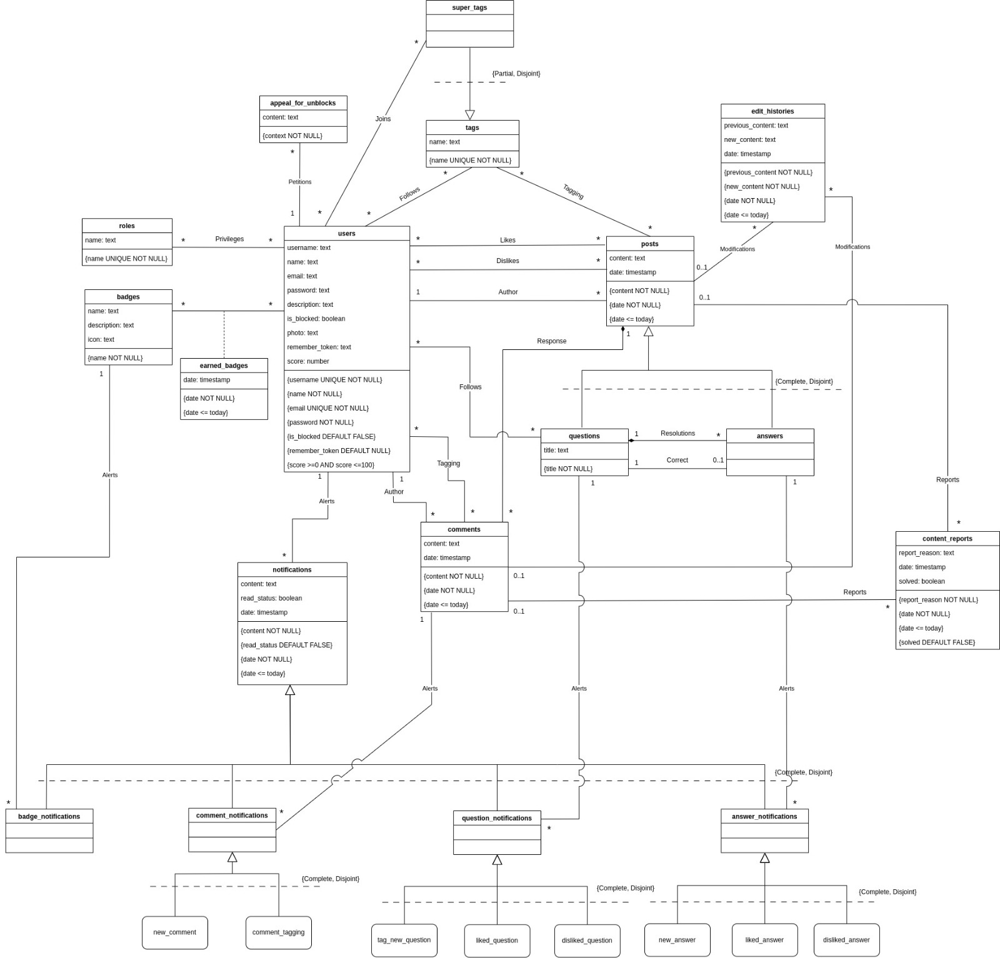

# EBD: Database Specification Component

## A4: Conceptual Data Model

This section presents the description of the entities involved and relationships associated with the AskUni project, together with its database specification.

### 4.1. Class diagram

The UML diagram below presents the main entities, the relationships between them, attributes and their domains, and lastly the multiplicity of relationships for the AskUni platform.



*Figure 5: AskUni conceptual data model in UML*


### 4.2. Additional Business Rules
 
Additional business rules or restrictions that cannot be conveyed in the UML class diagram of AskUni’s system.

| Identifier | Description                                                                                 |
|------------|---------------------------------------------------------------------------------------------|
| BR10 | A User cannot answer his own question |
| BR11 | A User cannot follow his own question |
| BR12 | A User cannot join a superTag he has already joined |
| BR13 | A User cannot publish a question in a superTag if he has not joined it |
| BR14 | A User cannot start to follow a question he already follows| 
| BR15 | A User cannot follow a tag he´s already following | 
| BR16 | A User can only appeal for unblock if he´s currently blocked|
| BR17 | A User cannot earn a badge he already earns|


*Table 13: AskUni Additional Business Rules.*


---


## A5: Relational Schema, validation and schema refinement

This artifact contains the Relational Schema created from the Conceptual Data Model shown in the previous artifact. It also contains the validation of the schema.

### 5.1. Relational Schema

| Relation reference | Relation Compact Notation |
| --- | --- |
| R01 | users(<ins>id</ins>, username **UK** **NN**, name **NN**, email **UK** **NN**, password **NN**, description, photo, is_blocked **DF** False, remember_token **DF** Null, score **CK**(score >=0 AND score <=100) ) |
| R02 | roles(<ins>id</ins>, name **UK** **NN**) |
| R03 | users_roles(<ins>users_id</ins>->users, <ins>roles_id</ins>->roles) |
| R04 | posts(<ins>id</ins>, content **NN**, date **NN** **CK**(date <= today), users_id->users) |
| R05 | users_likes_posts(<ins>users_id</ins>->users, <ins>posts_id</ins>->posts) |
| R06 | users_dislikes_posts(<ins>users_id</ins>->users, <ins>posts_id</ins>->posts) |
| R07 | tags(<ins>id</ins>, name **UK** **NN**) |
| R08 | super_tags(<ins>tags_id</ins>->tags) |
| R09 | users_join_super_tags(<ins>users_id</ins>->users, <ins>super_tags_id</ins>->super_tags) |
| R10 | users_follow_tags(<ins>users_id</ins>->users, <ins>tags_id</ins>->tags) |
| R11 | posts_tags(<ins>posts_id</ins>->posts, <ins>tags_id</ins>->tags) |
| R12 | questions(<ins>posts_id</ins>->posts, title **NN**, answers_id->answers **NB**) |
| R13 | answers(<ins>posts_id</ins>->posts, questions_id->questions) |
| R14 | comments(<ins>id</ins>, content **NN**, date **NN** **CK**(date <= today), users_id->users, posts_id->posts) |
| R15 | users_follow_questions(<ins>users_id</ins>->users, <ins>questions_id</ins>->questions) |
| R16 | comments_tagging_users(<ins>comments_id</ins>->comments, <ins>users_id</ins>->users) |
| R17 | badges(<ins>id</ins>, name **NN**, description, icon) |
| R18 | earned_badges(<ins>users_id</ins>->users, <ins>badges_id</ins>->badges, date **NN** **CK**(date <= today)) |
| R19 | notifications (<ins>id</ins>, content **NN**, read_status **DF** False, date **NN** **CK**(date <= today), users_id->users) |
| R20 | comments_notifications(<ins>notifications_id</ins>->notifications, comments_id->comments, notifications_type **NN** **CK** notifications_type IN comments_notifications_types) |
| R21 | questions_notifications(<ins>notifications_id</ins>->notifications, questions_id->questions, notifications_type **NN** **CK** notifications_type IN questions_notifications_types) |
| R22 | answers_notifications(<ins>notifications_id</ins>->notifications, answers_id->answers, notifications_type **NN** **CK** notifications_type IN answers_notifications_types) |
| R23 | badges_notifications(<ins>notifications_id</ins>->notifications, badges_id->badges) |
| R24 | appeal_for_unblocks(<ins>id</ins>, content **NN**, users_id->users) |
| R25 | content_reports(<ins>id</ins>, report_reason **NN**, date **NN** **CK**(date <= today), solved **DF** False, comments_id->comments **NB**, posts_id->posts **NB**) |
| R26 | edit_histories(<ins>id</ins>, previous_content **NN**, new_content **NN**, date **NN** **CK**(date <= today), posts_id->posts **NB**, comments_id->comments **NB**) |

*Table 14: AskUni Relational Schema.*

Legend: 
* UK = UNIQUE KEY
* NN = NOT NULL
* DF = DEFAULT
* CK = CHECK
* NB = NULLABLE

### 5.2. Domains

Specification of additional domains

| Domain Name | Domain Specification |
| --- | --- |
| today | DATE DEFAULT CURRENT_DATE |
| comments_notifications_types | ENUM ('new_comment', 'comment_tagging') |
| questions_notifications_types | ENUM ('tag_new_question', 'liked_question', 'disliked_question') |
| answers_notifications_types |ENUM ('new_answer', 'liked_answer', 'disliked_answer') |

*Table 15: AskUni Domains.*

### 5.3. Schema validation

| **TABLE R01**| users |
| --- | --- |
| **Keys** | {id}, {username}, {email}  |
| **Functional Dependencies:** | |
| FD0101 | id → {username, name, email, password, description, photo, is_blocked, remember_token, score} |
| FD0102 | username → {id, name, email, password, description, photo, is_blocked, remember_token, score} |
| FD0103 | email → {id, username, name, password, description, photo, is_blocked, remember_token, score} |
| **NORMAL FORM** | BCNF |

*Table 16: users schema validation.*

| **TABLE R02**| roles |
| --- | --- |
| **Keys** | {id, name} |
| **Functional Dependencies:** | |
| FD0201 | id → {name} |
| FD0202 | name → {id} |
| **NORMAL FORM** | BCNF |

*Table 17: roles schema validation.*

| **TABLE R03** | users_roles |
| --- | --- |
| **Keys** | {users_id, roles_id} |
| **Functional Dependencies:** | None |
| **NORMAL FORM** | BCNF |

*Table 18: users_roles schema validation.*

| **TABLE R04** | posts |
| --- | --- |
| **Keys** | {id} |
| **Functional Dependencies:** | |
| FD0401 | id → {content, date, users_id} |
| **NORMAL FORM** | BCNF |

*Table 19: posts schema validation.*

| **TABLE R05** | users_likes_posts |
| --- | --- |
| **Keys** | {users_id, posts_id} |
| **Functional Dependencies:** | None |
| **NORMAL FORM** | BCNF |

*Table 20: users_likes_posts schema validation.*

| **TABLE R06** | users_dislikes_posts |
| --- | --- |
| **Keys** | {users_id, posts_id} |
| **Functional Dependencies:** | None |
| **NORMAL FORM** | BCNF |

*Table 21: users_dislikes_posts schema validation.*

| **TABLE R07** | tags |
| --- | --- |
| **Keys** | {id}, {name} |
| **Functional Dependencies:** | |
| FD0701 | id → {name} |
| FD0702 | name → {id} |
| **NORMAL FORM** | BCNF |

*Table 22: tags schema validation.*

| **TABLE R08** | super_tags |
| --- | --- |
| **Keys** | {tags_id} |
| **Functional Dependencies:** | None |
| **NORMAL FORM** | BCNF |

*Table 23: super_tags schema validation.*

| **TABLE R09** | users_join_super_tags |
| --- | --- |
| **Keys** | {users_id, super_tags_id} |
| **Functional Dependencies:** | None |
| **NORMAL FORM** | BCNF |

*Table 24: users_join_super_tags schema validation.*

| **TABLE R10** | users_follow_tags |
| --- | --- |
| **Keys** | {users_id, tags_id} |
| **Functional Dependencies:** | None |
| **NORMAL FORM** | BCNF |

*Table 25: users_follow_tags schema validation.*

| **TABLE R11** | posts_tags |
| --- | --- |
| **Keys** | {posts_id, tags_id} |
| **Functional Dependencies:** | None |
| **NORMAL FORM** | BCNF |

*Table 26: posts_tags schema validation.*

| **TABLE R12** | questions |
| --- | --- |
| **Keys** | {posts_id} |
| **Functional Dependencies:** | |
| FD1201 | posts_id → {title, answers_id} |
| **NORMAL FORM** | BCNF |

*Table 27: questions schema validation.*

| **TABLE R13** | answers |
| --- | --- |
| **Keys** | {posts_id} |
| **Functional Dependencies:** | |
| FD1301 | posts_id → {questions_id} |
| **NORMAL FORM** | BCNF |

*Table 28: answers schema validation.*

| **TABLE R14** | comments |
| --- | --- |
| **Keys** | {id} |
| **Functional Dependencies:** | |
| FD1401 | id → {content, date, users_id, questions_id, answers_id} |
| **NORMAL FORM** | BCNF |

*Table 29: comments schema validation.*

| **TABLE R15** | users_follow_questions |
| --- | --- |
| **Keys** | {users_id, questions_id} |
| **Functional Dependencies:** | None |
| **NORMAL FORM** | BCNF |

*Table 30: users_follow_questions schema validation.*

| **TABLE R16** | comments_tagging_users |
| --- | --- |
| **Keys** | {comments_id, users_id} |
| **Functional Dependencies:** | None |
| **NORMAL FORM** | BCNF |

*Table 31: comments_tagging_users schema validation.*

| **TABLE R17** | badges |
| --- | --- |
| **Keys** | {id}, {name} |
| **Functional Dependencies:** | |
| FD1701 | id → {name, description, icon} |
| FD1702 | name → {id, description, icon} |
| **NORMAL FORM** | BCNF |

*Table 32: badges schema validation.*

| **TABLE R18** | earned_badges |
| --- | --- |
| **Keys** | {users_id, badges_id} |
| **Functional Dependencies:** | |
| FD1801 | {users_id, badges_id} → {date} |
| **NORMAL FORM** | BCNF |

*Table 33: earned_badges schema validation.*

| **TABLE R19** | notifications |
| --- | --- |
| **Keys** | {id} |
| **Functional Dependencies:** | |
| FD1901 | id → {content, read_status, date, users_id} |
| **NORMAL FORM** | BCNF |

*Table 34: notifications schema validation.*

| **TABLE R20** | comments_notifications |
| --- | --- |
| **Keys** | {notifications_id} |
| **Functional Dependencies:** | |
| FD2001 | {notifications_id} → {comments_id, notifications_type}
| **NORMAL FORM** | BCNF |

*Table 35: comments_notifications schema validation.*

| **TABLE R21** | questions_notifications |
| --- | --- |
| **Keys** | {notifications_id} |
| **Functional Dependencies:** | |
| FD2101 | {notifications_id} → {questions_id, notifications_type}
| **NORMAL FORM** | BCNF |

*Table 36: questions_notifications schema validation.*

| **TABLE R22** | answers_notifications |
| --- | --- |
| **Keys** | {notifications_id} |
| **Functional Dependencies:** | |
| FD2201 | {notifications_id} → {answers_id, notifications_type}
| **NORMAL FORM** | BCNF |

*Table 37: answers_notifications schema validation.*

| **TABLE R23** | badges_notifications |
| --- | --- |
| **Keys** | {notifications_id} |
| **Functional Dependencies:** | |
| FD2301 | {notifications_id} → {badges_id}
| **NORMAL FORM** | BCNF |

*Table 38: badges_notifications schema validation.*

| **TABLE R24** | appeal_for_unblocks |
| --- | --- |
| **Keys** | {id} |
| **Functional Dependencies:** | |
| FD2401 | id → {content, users_id} |
| **NORMAL FORM** | BCNF |

*Table 39: appeal_for_unblocks schema validation.*

| **TABLE R25** | content_reports |
| --- | --- |
| **Keys** | {id} |
| **Functional Dependencies:** | |
| FD2501 | id → {report_reason, date, solved, comments_id, posts_id} |
| **NORMAL FORM** | BCNF |

*Table 40: content_reports schema validation.*

| **TABLE R26** | edit_histories |
| --- | --- |
| **Keys** | {id} |
| **Functional Dependencies:** | |
| FD2601 | id → {previous_content, new_content, date, posts_id, comments_id} |
| **NORMAL FORM** | BCNF |

*Table 41: edit_histories schema validation.*

Since all relations already satisfy the conditions of Boyce-Codd Normal Form (BCNF), the relational schema as a whole is inherently in BCNF. This ensures that no additional normalization steps are needed for the schema.

---


## A6: Indexes, triggers, transactions and database population

The A6 artifact includes the PostgreSQL code, encompassing the database’s physical schema and data population. It defines data integrity rules through triggers, identifies and describes indexes, and specifies user-defined functions within the database.

Additionally, it outlines the necessary transactions to maintain data accuracy following database accesses or modifications. The required isolation level is also detailed to ensure proper handling of concurrent operations.

### 6.1. Database Workload
 
To create a well-structured database, it's crucial to understand both the expected growth of each table and its access frequency. The table below presents these projected estimates:

| **Relation reference** | **Relation Name**         | **Order of magnitude** | **Estimated growth**        |
|------------------------|---------------------------|------------------------|-----------------------------|
| R01                    | users                     | 10k                    | dozens per day             |
| R02                    | roles                     | 10                     | no growth                  |
| R03                    | users_roles               | 10k                    | dozens per day             |
| R04                    | posts                     | 1k                     | hundreds per month         |
| R05                    | users_likes_posts         | 10k                    | dozens per day             |
| R06                    | users_dislikes_posts      | 10k                    | dozens per day             |
| R07                    | tags                      | 100                    | no growth                  |
| R08                    | super_tags                | 100                    | no growth                  |
| R09                    | users_join_super_tags      | 1k                     | dozens per month           |
| R10                    | users_follow_tags         | 1k                     | dozens per day             |
| R11                    | posts_tags                | 10k                    | hundreds per month         |
| R12                    | questions                 | 1k                     | dozens per month           |
| R13                    | answers                   | 1k                     | dozens per month           |
| R14                    | comments                  | 1k                     | hundreds per month         |
| R15                    | users_follow_questions      | 1k                     | dozens per month           |
| R16                    | comments_tagging_users      | 1k                     | dozens per month           |
| R17                    | badges                    | 100                    | no growth                  |
| R18                    | earned_badges             | 1k                     | dozens per month           |
| R19                    | notifications             | 10k                    | thousands per month        |
| R20                    | comments_notifications     | 1k                     | dozens per month           |
| R21                    | questions_notifications    | 100                    | no growth                  |
| R22                    | answers_notifications      | 100                    | no growth                  |
| R23                    | badges_notifications       | 100                    | no growth                  |
| R24                    | appeal_for_unblocks       | 100                    | no growth                  |
| R25                    | content_reports           | 100                    | dozens per month           |
| R26                    | edit_histories            | 100                    | dozens per month           |

*Table 42: AskUni workload.*

### 2. Proposed Indices

Indexes enhance database performance by enabling faster retrieval of specific rows. When an index is defined on a column used in a join condition, it can greatly accelerate join operations, reducing query execution time. Additionally, indexes can improve the efficiency of UPDATE and DELETE operations when they involve search conditions, allowing the database to quickly locate the relevant rows.

#### 2.1. Performance Indices

Certain queries that would typically take a long time to execute can be optimised with performance indexes. By using these indexes, we can significantly speed up SELECT queries, though this may slightly increase the execution time for INSERT, UPDATE, and DELETE operations. Nevertheless, for some tables, the faster search capabilities outweigh these trade-offs. The tables below outline the performance indexes in use:

| **Index**           | IDX01 |
| ---                 | ---   |
| **Relation**        | users |
| **Attribute**       | username  |
| **Type**            | B-tree |
| **Cardinality**     | medium |
| **Clustering**      | yes |
| **Justification**   | The users table is frequently accessed for SELECT operations based on the username, making it an ideal candidate for indexing with a B-tree to enhance query performance. |
| **SQL code** | `CREATE INDEX users_username ON users USING btree(username); CLUSTER users USING users_username;` | 

*Table 43: Username Index.*

| **Index** | IDX02 |
| --- | --- |
| **Relation** | posts |
| **Attribute** | users_id |
| **Type** | B-tree |
| **Cardinality** | medium |
| **Clustering** | yes |
| **Justification** | The users_id column is used for querying posts by their authors. Indexing this column will speed up queries that filter posts by user. |
| **SQL code** | `CREATE INDEX posts_users_id ON posts USING btree(users_id); CLUSTER posts USING posts_users_id;` |

*Table 44: Posts Users ID Index.*

| **Index** | IDX03 |
| --- | --- |
| **Relation** | comments |
| **Attribute** | users_id |
| **Type** | B-tree |
| **Cardinality** | medium |
| **Clustering** | yes |
| **Justification** | Indexing users_id in the comments table will optimize performance for queries retrieving comments by specific users. |
| **SQL code** | `CREATE INDEX comments_users_id ON comments USING btree(users_id); CLUSTER comments USING comments_users_id;` |

*Table 45: Comments Users ID Index.*

| **Index** | IDX04 |
| --- | --- |
| **Relation** | questions |
| **Attribute** | posts_id |
| **Type** | B-tree |
| **Cardinality** | medium |
| **Clustering** | yes |
| **Justification** | This index will enhance performance for queries that retrieve questions associated with specific posts. |
| **SQL code** | `CREATE INDEX questions_posts_id ON questions USING btree(posts_id); CLUSTER questions USING questions_posts_id;` |

*Table 46: Questions Posts ID Index.*

| **Index**           | IDX05 |
| ---                 | ---   |
| **Relation**        | answers |
| **Attribute**       | posts_id |
| **Type**            | B-tree |
| **Cardinality**     | medium |
| **Clustering**      | yes |
| **Justification**   | This index will enhance performance for queries that retrieve answers associated with specific posts. |
| **SQL code** | `CREATE INDEX answers_posts_id ON answers USING btree(posts_id); CLUSTER answers USING answers_posts_id;` |

*Table 47: Answers Posts ID Index .*

| **Index**           | IDX06 |
| ---                 | ---   |
| **Relation**        | comments |
| **Attribute**       | posts_id |
| **Type**            | B-tree |
| **Cardinality**     | medium |
| **Clustering**      | yes |
| **Justification**   | This index will enhance performance for queries that retrieve comments associated with specific posts. |
| **SQL code** | `CREATE INDEX comments_posts_id ON comments USING btree(posts_id); CLUSTER comments USING comments_posts_id;` |

*Table 48: Comments Posts ID Index .*

| **Index** | IDX07 |
| --- | --- |
| **Relation** | notifications |
| **Attribute** | users_id |
| **Type** | B-tree |
| **Cardinality** | high |
| **Clustering** | yes |
| **Justification** | Notifications are frequently queried by the user they are directed to. Indexing users_id will improve performance in retrieving notifications for specific users. |
| **SQL code** | `CREATE INDEX notifications_users_id ON notifications USING btree(users_id); CLUSTER notifications USING notifications_users_id;` |

*Table 49: Notifications Users ID Index .*

| **Index** | IDX08 |
| --- | --- |
| **Relation** | badges |
| **Attribute** | name |
| **Type** | B-tree |
| **Cardinality** | low |
| **Clustering** | yes |
| **Justification** | The name field is likely queried to check for badge existence. Indexing will enhance performance for such lookups. |
| **SQL code** | `CREATE INDEX badges_name ON badges USING btree(name); CLUSTER badges USING badges_name;` |

*Table 50: Badges Name Index .*

#### 2.2. Full-text Search Indices 


According to the project requirements, full-text search indexes are necessary. To enhance the efficiency of text-based queries, we implemented Full-Text Search (FTS) indexes on the tables and columns most likely to be frequently queried. These indexes are listed in the tables below: 

| **Index**	| IDX09 |
| --- | --- |
| **Relation**	| posts |
| **Attribute** |	content |
| **Type** |	GIN |
| **Clustering**	| no |
| **Justification** |	Full-text search on the content of posts is essential for user searches. A GIN index is appropriate for this use case due to the nature of the text data. |

>SQL code:
``` sql 
ALTER TABLE posts ADD COLUMN tsvectors TSVECTOR;

CREATE OR REPLACE FUNCTION posts_search_update() RETURNS trigger AS $$
BEGIN
    IF TG_OP = 'INSERT' THEN
        NEW.tsvectors := setweight(to_tsvector('english', coalesce(NEW.content, '')), 'A');
        RETURN NEW;
    END IF;

    IF TG_OP = 'UPDATE' THEN
        IF NEW.content <> OLD.content THEN
            NEW.tsvectors := setweight(to_tsvector('english', coalesce(NEW.content, '')), 'A');
            RETURN NEW;
        END IF;
    END IF;

    RETURN NULL;
END $$ LANGUAGE plpgsql;

CREATE TRIGGER posts_search_update BEFORE INSERT OR UPDATE ON posts
    FOR EACH ROW EXECUTE PROCEDURE posts_search_update();

CREATE INDEX posts_search_idx ON posts USING GIN(tsvectors);
```
*Table 51: Posts Full-text Search .*

| **Index**	| IDX10 |
| --- | --- |
| **Relation**	| comments |
| **Attribute** |	content |
| **Type** |	GIN |
| **Clustering**	| no |
| **Justification** |	Enabling full-text search on comment content allows for efficient searching of user comments within the application. |

>SQL code:
``` sql 
ALTER TABLE comments ADD COLUMN tsvectors TSVECTOR;

CREATE OR REPLACE FUNCTION comments_search_update() RETURNS trigger AS $$
BEGIN
    IF TG_OP = 'INSERT' THEN
        NEW.tsvectors := setweight(to_tsvector('english', coalesce(NEW.content, '')), 'A');
        RETURN NEW;
    END IF;

    IF TG_OP = 'UPDATE' THEN
        IF NEW.content <> OLD.content THEN
            NEW.tsvectors := setweight(to_tsvector('english', coalesce(NEW.content, '')), 'A');
            RETURN NEW;
        END IF;
    END IF;

    RETURN NULL;
END $$ LANGUAGE plpgsql;

CREATE TRIGGER comments_search_update BEFORE INSERT OR UPDATE ON comments
    FOR EACH ROW EXECUTE PROCEDURE comments_search_update();

CREATE INDEX comments_search_idx ON comments USING GIN(tsvectors);
``` 
*Table 52: Comments Full-text Search .*

| **Index**	| IDX11 |
| --- | --- |
| **Relation** |	users |
| **Attribute** |	username, name |
| **Type** |	GIN |
| **Clustering** |	no |
| **Justification** |	This index will enhance search performance for user lookups based on username and name. Full-text search capabilities allow users to find users by partial names or phrases efficiently. |

>SQL code:
```sql
ALTER TABLE users ADD COLUMN tsvectors TSVECTOR;

CREATE OR REPLACE FUNCTION users_search_update() RETURNS trigger AS $$
BEGIN
    IF TG_OP = 'INSERT' THEN
        NEW.tsvectors := setweight(to_tsvector('english', coalesce(NEW.username, '')), 'A') ||
                         setweight(to_tsvector('english', coalesce(NEW.name, '')), 'B');
        RETURN NEW;
    END IF;

    IF TG_OP = 'UPDATE' THEN
        IF NEW.username <> OLD.username OR NEW.name <> OLD.name THEN
            NEW.tsvectors := setweight(to_tsvector('english', coalesce(NEW.username, '')), 'A') ||
                             setweight(to_tsvector('english', coalesce(NEW.name, '')), 'B');
            RETURN NEW;
        END IF;
    END IF;

    RETURN NULL;
END $$ LANGUAGE plpgsql;

CREATE TRIGGER users_search_update BEFORE INSERT OR UPDATE ON users
    FOR EACH ROW EXECUTE PROCEDURE users_search_update();

CREATE INDEX users_search_idx ON users USING GIN(tsvectors);
```
*Table 53: Users Full-text Search .*

| **Index** |	IDX13 |
| --- | --- |
| **Relation** |	tags |
| **Attribute** |	tag_name |
| **Type** |	GIN |
| **Clustering** |	no |
| **Justification** |	This index will enhance search performance for tag lookups. Full-text search capabilities will allow users to find content associated with specific tags efficiently. |

>SQL code:
```sql
ALTER TABLE tags ADD COLUMN tsvectors TSVECTOR;
CREATE OR REPLACE FUNCTION tags_search_update() RETURNS trigger AS $$
BEGIN
    IF TG_OP = 'INSERT' THEN
        NEW.tsvectors := setweight(to_tsvector('english', coalesce(NEW.name, '')), 'A');
        RETURN NEW;
    END IF;

    IF TG_OP = 'UPDATE' THEN
        IF NEW.name <> OLD.name THEN
            NEW.tsvectors := setweight(to_tsvector('english', coalesce(NEW.name, '')), 'A');
            RETURN NEW;
        END IF;
    END IF;

    RETURN NULL; 
END $$ LANGUAGE plpgsql;

CREATE TRIGGER tags_search_update BEFORE INSERT OR UPDATE ON tags
    FOR EACH ROW EXECUTE PROCEDURE tags_search_update();

CREATE INDEX tags_search_idx ON tags USING GIN(tsvectors);
```
*Table 54: Tags Full-text Search .*

### 3. Triggers
 

To ensure the enforcement of integrity rules that cannot be easily implemented through other means, we identify and describe the necessary triggers by outlining the event, the condition, and the corresponding activation code. Additionally, triggers are utilised to maintain the accuracy of full-text indexes.

| **Trigger**      | TRIGGER01                              |
|------------------|----------------------------------------|
| **Description**  | Notifies the post author about a new comment on their post. |

>SQL code:
```sql
CREATE OR REPLACE FUNCTION new_comment_notification() RETURNS TRIGGER AS
$BODY$
DECLARE
    new_notification_id INTEGER;
BEGIN
    INSERT INTO notifications (content, read_status, date, users_id)
    VALUES (
        'A new comment has been added to your post.',
        FALSE,
        NEW.date,
        (SELECT users_id FROM posts WHERE id = NEW.posts_id)
    )
    RETURNING id INTO new_notification_id;

    INSERT INTO comments_notifications (notifications_id, comments_id, notifications_type)
    VALUES (
        new_notification_id,
        NEW.id,
        'new_comment'
    );

    RETURN NEW;
END
$BODY$
LANGUAGE plpgsql;

CREATE TRIGGER new_comment_notification
    AFTER INSERT ON comments
    FOR EACH ROW
    EXECUTE PROCEDURE new_comment_notification();
```
*Table 55: Trigger - Notification of new comment on a post*

| **Trigger**      | TRIGGER02                              |
|------------------|----------------------------------------|
| **Description**  | Notifies the user when they are tagged in a comment. |

>SQL code:
```sql
CREATE OR REPLACE FUNCTION comment_tagging_notification() RETURNS TRIGGER AS
$BODY$
DECLARE
    new_notification_id INTEGER;
BEGIN
    INSERT INTO notifications (content, read_status, date, users_id)
    VALUES (
        'You have been tagged in a comment.',
        FALSE,
        now(),
        NEW.users_id
    ) 
    RETURNING id INTO new_notification_id;

    INSERT INTO comments_notifications (notifications_id, comments_id, notifications_type)
    VALUES (new_notification_id, NEW.comments_id, 'comment_tagging');

    RETURN NEW;
END
$BODY$
LANGUAGE plpgsql;

CREATE TRIGGER comment_tagging_notification
    AFTER INSERT ON comments_tagging_users
    FOR EACH ROW
    EXECUTE PROCEDURE comment_tagging_notification();
```
*Table 56: Trigger - Notification of user tagged in a comment*

| **Trigger**      | TRIGGER03                              |
|------------------|----------------------------------------|
| **Description**  | Notifies followers of a tag when a new question is posted with a followed tag. |

>SQL code:
```sql
CREATE OR REPLACE FUNCTION tag_new_question_notification() RETURNS TRIGGER AS $$
DECLARE
    follower_id INTEGER;
    tag_id INTEGER;
    new_notification_id INTEGER;
BEGIN
    FOR tag_id IN
        SELECT tags_id
        FROM posts_tags
        WHERE posts_id = NEW.posts_id
    LOOP
        FOR follower_id IN
            SELECT users_id
            FROM users_follow_tags
            WHERE tags_id = tag_id
        LOOP
            INSERT INTO notifications (content, read_status, date, users_id)
            VALUES (
                CONCAT('A new question has been posted with a tag you follow: "', NEW.title, '".'),
                FALSE,
                now(),
                follower_id
            )
            RETURNING id into new_notification_id;
            
            INSERT INTO questions_notifications (notifications_id, questions_id, notifications_type)
            VALUES (new_notification_id, NEW.posts_id, 'tag_new_question');
        END LOOP;
    END LOOP;

    RETURN NEW;
END;
$$ LANGUAGE plpgsql;

CREATE TRIGGER tag_new_question_notification
AFTER INSERT ON questions
FOR EACH ROW
EXECUTE FUNCTION tag_new_question_notification();
```
*Table 57: Trigger - Notification of new question with followed tag*

| **Trigger**      | TRIGGER04                              |
|------------------|----------------------------------------|
| **Description**  | Notifies the question author when someone likes their question. |

>SQL code:
```sql
CREATE OR REPLACE FUNCTION liked_question_notification() RETURNS TRIGGER AS $$
DECLARE
    question_author_id INTEGER;
    new_notification_id INTEGER;
BEGIN
    IF EXISTS (SELECT 1 FROM questions WHERE posts_id = NEW.posts_id) THEN
        SELECT users_id INTO question_author_id
        FROM posts
        WHERE id = NEW.posts_id;

        INSERT INTO notifications (content, read_status, date, users_id)
        VALUES (
            'Your question has been liked.',
            FALSE,
            now(),
            question_author_id
        )
        RETURNING id INTO new_notification_id;

        INSERT INTO questions_notifications (notifications_id, questions_id, notifications_type)
        VALUES (
            new_notification_id,
            NEW.posts_id,
            'liked_question'
        );
    END IF;

    RETURN NEW;
END;
$$ LANGUAGE plpgsql;

CREATE TRIGGER liked_question_notification
AFTER INSERT ON users_likes_posts
FOR EACH ROW
EXECUTE FUNCTION liked_question_notification();
```
*Table 58: Trigger - Notification of liked question*

| **Trigger**      | TRIGGER05                              |
|------------------|----------------------------------------|
| **Description**  | Notifies the question author when someone dislikes their question. |

>SQL code:
```sql
CREATE OR REPLACE FUNCTION disliked_question_notification() RETURNS TRIGGER AS $$
DECLARE
    question_author_id INTEGER;
    new_notification_id INTEGER;
BEGIN
    IF EXISTS (SELECT 1 FROM questions WHERE posts_id = NEW.posts_id) THEN
        SELECT users_id INTO question_author_id
        FROM posts
        WHERE id = NEW.posts_id;

        INSERT INTO notifications (content, read_status, date, users_id)
        VALUES (
            'Your question has been disliked.',
            FALSE,
            now(),
            question_author_id
        )
        RETURNING id INTO new_notification_id;

        INSERT INTO questions_notifications (notifications_id, questions_id, notifications_type)
        VALUES (
            new_notification_id,
            NEW.posts_id,
            'disliked_question'
        );
    END IF;

    RETURN NEW;
END;
$$ LANGUAGE plpgsql;

CREATE TRIGGER disliked_question_notification
AFTER INSERT ON users_dislikes_posts
FOR EACH ROW
EXECUTE FUNCTION disliked_question_notification();
```
*Table 59: Trigger - Notification of disliked question*

| **Trigger**      | TRIGGER06                              |
|------------------|----------------------------------------|
| **Description**  | Notifies the question author when their question receives a new answer. |

>SQL code:
```sql
CREATE OR REPLACE FUNCTION new_answer_notification() RETURNS TRIGGER AS $$
DECLARE
    question_author_id INTEGER;
    new_notification_id INTEGER;
BEGIN
    SELECT users_id INTO question_author_id
    FROM posts
    WHERE id = (SELECT posts_id FROM questions WHERE posts_id = NEW.questions_id);

    INSERT INTO notifications (content, read_status, date, users_id)
    VALUES (
        'Your question has received a new answer.',
        FALSE,
        now(),
        question_author_id
    )
    RETURNING id INTO new_notification_id;

    INSERT INTO answers_notifications (notifications_id, answers_id, notifications_type)
    VALUES (
        new_notification_id,
        NEW.posts_id,
        'new_answer'
    );

    RETURN NEW;
END;
$$ LANGUAGE plpgsql;

CREATE TRIGGER new_answer_notification
AFTER INSERT ON answers
FOR EACH ROW
EXECUTE FUNCTION new_answer_notification();
```
*Table 60: Trigger - Notification of new answer*

| **Trigger**      | TRIGGER07                              |
|------------------|----------------------------------------|
| **Description**  | Notifies the answer author when someone likes their answer. |

>SQL code:
```sql
CREATE OR REPLACE FUNCTION liked_answer_notification() RETURNS TRIGGER AS $$
DECLARE
    answer_author_id INTEGER;
    new_notification_id INTEGER;
BEGIN
    IF EXISTS (SELECT 1 FROM answers WHERE posts_id = NEW.posts_id) THEN
        SELECT users_id INTO answer_author_id
        FROM posts
        WHERE id = NEW.posts_id;

        INSERT INTO notifications (content, read_status, date, users_id)
        VALUES (
            'Your answer has been liked.',
            FALSE,
            now(),
            answer_author_id
        )
        RETURNING id INTO new_notification_id;

        INSERT INTO answers_notifications (notifications_id, answers_id, notifications_type)
        VALUES (
            new_notification_id,
            NEW.posts_id,
            'liked_answer'
        );
    END IF;

    RETURN NEW;
END;
$$ LANGUAGE plpgsql;

CREATE TRIGGER liked_answer_notification
AFTER INSERT ON users_likes_posts
FOR EACH ROW
EXECUTE FUNCTION liked_answer_notification();
```
*Table 61: Trigger - Notification of liked answer*

| **Trigger**      | TRIGGER08                              |
|------------------|----------------------------------------|
| **Description**  | Notifies the answer author when someone dislikes their answer. |

>SQL code:
```sql
CREATE OR REPLACE FUNCTION disliked_answer_notification() RETURNS TRIGGER AS $$
DECLARE
    answer_author_id INTEGER;
    new_notification_id INTEGER;
BEGIN
    IF EXISTS (SELECT 1 FROM answers WHERE posts_id = NEW.posts_id) THEN
        SELECT users_id INTO answer_author_id
        FROM posts
        WHERE id = NEW.posts_id;

        INSERT INTO notifications (content, read_status, date, users_id)
        VALUES (
            'Your answer has been disliked.',
            FALSE,
            now(),
            answer_author_id
        )
        RETURNING id INTO new_notification_id;

        INSERT INTO answers_notifications (notifications_id, answers_id, notifications_type)
        VALUES (
            new_notification_id,
            NEW.posts_id,
            'disliked_answer'
        );
    END IF;

    RETURN NEW;
END;
$$ LANGUAGE plpgsql;

CREATE TRIGGER disliked_answer_notification
AFTER INSERT ON users_dislikes_posts
FOR EACH ROW
EXECUTE FUNCTION disliked_answer_notification();
```
*Table 62: Trigger - Notification of disliked answer*

| **Trigger**      | TRIGGER09                              |
|------------------|----------------------------------------|
| **Description**  | Automatically adds tagged users in a comment to the `comments_tagging_users` table. |

>SQL code:
```sql
CREATE OR REPLACE FUNCTION add_tagged_users_to_comments() RETURNS TRIGGER AS $$
DECLARE
    tagged_username TEXT;
    user_id INTEGER;
    tag_pattern TEXT := '@([a-zA-Z0-9_.-]+)';
BEGIN
    FOR tagged_username IN SELECT (regexp_matches(NEW.content, tag_pattern, 'g'))[1] LOOP
        SELECT id INTO user_id FROM users WHERE username = tagged_username;

        IF user_id IS NOT NULL AND user_id != NEW.users_id THEN
            IF NOT EXISTS (
                SELECT 1 FROM comments_tagging_users 
                WHERE comments_id = NEW.id AND users_id = user_id
            ) THEN
                INSERT INTO comments_tagging_users (comments_id, users_id)
                VALUES (NEW.id, user_id);
            END IF;
        END IF;
    END LOOP;

    RETURN NEW;
END;
$$ LANGUAGE plpgsql;

CREATE TRIGGER add_tagged_users_to_comments
AFTER INSERT ON comments
FOR EACH ROW
EXECUTE FUNCTION add_tagged_users_to_comments();
```
*Table 63: Trigger - Add tagged users in a comment to comments_tagging_users table*

| **Trigger**      | TRIGGER10                              |
|------------------|----------------------------------------|
| **Description**  | Awards a badge to the post author when their post receives 20 likes. |

>SQL code:
```sql
CREATE OR REPLACE FUNCTION add_badge_on_20_likes() RETURNS TRIGGER AS $$
DECLARE
    post_author_id INTEGER;
    badge_id INTEGER;
    like_count INTEGER;
BEGIN
    SELECT id INTO badge_id FROM badges WHERE id = 1;

    SELECT users_id INTO post_author_id
    FROM posts
    WHERE id = NEW.posts_id;

    SELECT COUNT(*) INTO like_count
    FROM users_likes_posts
    WHERE posts_id = NEW.posts_id;

    IF like_count = 20 THEN
        IF NOT EXISTS (
            SELECT 1 FROM earned_badges
            WHERE users_id = post_author_id AND badges_id = badge_id
        ) THEN
            INSERT INTO earned_badges (users_id, badges_id, date)
            VALUES (post_author_id, badge_id, now());
        END IF;
    END IF;

    RETURN NEW;
END;
$$ LANGUAGE plpgsql;

CREATE TRIGGER add_badge_on_20_likes
AFTER INSERT ON users_likes_posts
FOR EACH ROW
EXECUTE FUNCTION add_badge_on_20_likes();
```
*Table 64: Trigger - Award badge to user receiving 20 likes on a post*

| **Trigger**      | TRIGGER11                              |
|------------------|----------------------------------------|
| **Description**  | Awards a badge to the user when they create their first question. |

>SQL code:
```sql
CREATE OR REPLACE FUNCTION add_badge_on_first_question() RETURNS TRIGGER AS $$
DECLARE
    question_count INTEGER;
    post_author_id INTEGER;
BEGIN
    SELECT users_id INTO post_author_id FROM posts WHERE id = NEW.posts_id;

    SELECT COUNT(*) INTO question_count
    FROM questions q
    JOIN posts p ON q.posts_id = p.id
    WHERE p.users_id = post_author_id;

    IF question_count = 1 THEN
        IF NOT EXISTS (
            SELECT 1 FROM earned_badges
            WHERE users_id = post_author_id AND badges_id = 2
        ) THEN
            INSERT INTO earned_badges (users_id, badges_id, date)
            VALUES (post_author_id, 2, now());
        END IF;
    END IF;

    RETURN NEW;
END;
$$ LANGUAGE plpgsql;

CREATE TRIGGER add_badge_on_first_question
AFTER INSERT ON questions
FOR EACH ROW
EXECUTE FUNCTION add_badge_on_first_question();
```
*Table 65: Trigger - Award badge to user for first question created*

| **Trigger**      | TRIGGER12                              |
|------------------|----------------------------------------|
| **Description**  | Awards a badge to the user when they provide their first correct answer. |

>SQL code:
```sql
CREATE OR REPLACE FUNCTION add_badge_on_first_correct_answer() RETURNS TRIGGER AS $$
DECLARE
    answer_author_id INTEGER;
    correct_answer_count INTEGER;
BEGIN

    SELECT users_id INTO answer_author_id
    FROM posts
    WHERE id = NEW.answers_id;

    SELECT COUNT(*) INTO correct_answer_count
    FROM questions q
    JOIN posts p ON q.answers_id = p.id
    WHERE p.users_id = answer_author_id;

    IF correct_answer_count = 1 THEN
        IF NOT EXISTS (
            SELECT 1 FROM earned_badges
            WHERE users_id = answer_author_id AND badges_id = 3
        ) THEN
            INSERT INTO earned_badges (users_id, badges_id, date)
            VALUES (answer_author_id, 3, now());
        END IF;
    END IF;

    RETURN NEW;
END;
$$ LANGUAGE plpgsql;

CREATE TRIGGER add_badge_on_first_correct_answer
AFTER UPDATE OF answers_id ON questions
FOR EACH ROW
WHEN (NEW.answers_id IS DISTINCT FROM OLD.answers_id)
EXECUTE FUNCTION add_badge_on_first_correct_answer();
```
*Table 66: Trigger - Award badge to user for first correct answer*

| **Trigger**      | TRIGGER13                              |
|------------------|----------------------------------------|
| **Description**  | Notifies the user when they earn a new badge. |

>SQL code:
```sql
CREATE OR REPLACE FUNCTION new_badge_notification() RETURNS TRIGGER AS $$
DECLARE
    badge_name TEXT;
    notification_content TEXT;
    new_notification_id INTEGER;
BEGIN
    SELECT name INTO badge_name FROM badges WHERE id = NEW.badges_id;

    notification_content := 'Congratulations! You have earned a new badge: ' || badge_name;

    INSERT INTO notifications (content, read_status, date, users_id)
    VALUES (notification_content, FALSE, now(), NEW.users_id)
    RETURNING id INTO new_notification_id;

    INSERT INTO badges_notifications (notifications_id, badges_id)
    VALUES (new_notification_id, NEW.badges_id);

    RETURN NEW;
END;
$$ LANGUAGE plpgsql;

CREATE TRIGGER new_badge_notification
AFTER INSERT ON earned_badges
FOR EACH ROW
EXECUTE FUNCTION new_badge_notification();
```
*Table 67: Trigger - Notification of new badge earned*

| **Trigger**      | TRIGGER14                              |
|------------------|----------------------------------------|
| **Description**  | Increments the user's score upon receiving a like on their post, up to a maximum of 100 points, and only if the liking user is different from the author. |

>SQL code:
```sql
CREATE OR REPLACE FUNCTION increment_user_score() RETURNS TRIGGER AS $$
DECLARE
	user_id INTEGER;
	user_id_score INTEGER;
BEGIN
    SELECT users_id INTO user_id FROM posts WHERE id = NEW.posts_id;
    SELECT score INTO user_id_score FROM users WHERE id = user_id;
    IF (user_id_score < 100) 
       AND NEW.users_id <> (user_id) THEN
        UPDATE users
        SET score = score + 1
        WHERE id = user_id;
    END IF;

    RETURN NEW;
END;
$$ LANGUAGE plpgsql;
CREATE TRIGGER trigger_increment_user_score
AFTER INSERT ON users_likes_posts
FOR EACH ROW
EXECUTE FUNCTION increment_user_score();
```
*Table 68: Trigger - Update user score when receiving a like on a post*

| **Trigger**      | TRIGGER15                              |
|------------------|----------------------------------------|
| **Description**  | Decreases the user's score upon receiving a dislike on their post, down to a minimum of 0 points, and only if the disliking user is different from the author. |

>SQL code:
```sql
CREATE OR REPLACE FUNCTION decrement_user_score() RETURNS TRIGGER AS $$
DECLARE
	user_id INTEGER;
	user_id_score INTEGER;
BEGIN
    SELECT users_id INTO user_id FROM posts WHERE id = NEW.posts_id;
    SELECT score INTO user_id_score FROM users WHERE id = user_id;
    IF (user_id_score > 0) 
       AND NEW.users_id <> (user_id) THEN
        UPDATE users
        SET score = score - 1
        WHERE id = user_id;
    END IF;

    RETURN NEW;
END;
$$ LANGUAGE plpgsql;
CREATE TRIGGER trigger_decrement_user_score
AFTER INSERT ON users_dislikes_posts
FOR EACH ROW
EXECUTE FUNCTION decrement_user_score();
```
*Table 69: Trigger - Update user score when receiving a dislike on a post*


| **Trigger**      | TRIGGER16                              |
|------------------|----------------------------------------|
| **Description**  | Maintains an edit history for posts by storing previous and new content. |

>SQL code:
```sql
CREATE OR REPLACE FUNCTION log_post_edit() RETURNS TRIGGER AS $$
BEGIN
    INSERT INTO edit_histories (previous_content, new_content, date, posts_id)
    VALUES (OLD.content, NEW.content, now(), OLD.id);
    RETURN NEW;
END;
$$ LANGUAGE plpgsql;

CREATE TRIGGER trigger_log_post_edit
BEFORE UPDATE ON posts
FOR EACH ROW
WHEN (OLD.content IS DISTINCT FROM NEW.content)
EXECUTE FUNCTION log_post_edit();
```
*Table 70: Trigger - Maintain edit history of posts*

| **Trigger**      | TRIGGER17                              |
|------------------|----------------------------------------|
| **Description**  | Maintains an edit history for comments by storing previous and new content. |

>SQL code:
```sql
CREATE OR REPLACE FUNCTION log_comment_edit() RETURNS TRIGGER AS $$
BEGIN
    INSERT INTO edit_histories (previous_content, new_content, date, comments_id)
    VALUES (OLD.content, NEW.content, now(), OLD.id);
    RETURN NEW;
END;
$$ LANGUAGE plpgsql;

CREATE TRIGGER trigger_log_comment_edit
BEFORE UPDATE ON comments
FOR EACH ROW
WHEN (OLD.content IS DISTINCT FROM NEW.content)
EXECUTE FUNCTION log_comment_edit();
```
*Table 71: Trigger - Maintain edit history of comments*

| **Trigger**      | TRIGGER18                              |
|------------------|----------------------------------------|
| **Description**  | Blocks the user upon receiving more than 10 reports on the same post. |

>SQL code:
```sql
CREATE OR REPLACE FUNCTION block_user_on_excessive_reports() RETURNS TRIGGER AS
$$
DECLARE
    report_count INTEGER;
BEGIN
    SELECT COUNT(*) INTO report_count
    FROM content_reports
    WHERE posts_id = NEW.posts_id;

    IF report_count > 10 THEN
        UPDATE users
        SET is_blocked = TRUE
        WHERE id = (SELECT users_id FROM posts WHERE id = NEW.posts_id);
    END IF;

    RETURN NEW;
END
$$ LANGUAGE plpgsql;
CREATE TRIGGER trigger_block_user_on_excessive_reports
AFTER INSERT ON content_reports
FOR EACH ROW
EXECUTE FUNCTION block_user_on_excessive_reports();
```
*Table 72: Trigger - Block user upon excessive reports on the same post*

| **Trigger**      | TRIGGER19                              |
|------------------|----------------------------------------|
| **Description**  | Updates the `date` field of the comment to mark it as edited. |

>SQL code:
```sql
CREATE OR REPLACE FUNCTION mark_comment_as_edited()
RETURNS TRIGGER AS $$
BEGIN
    UPDATE comments SET date = now()
    WHERE id = NEW.id;
    RETURN NEW;
END;
$$ LANGUAGE plpgsql;

CREATE TRIGGER trigger_mark_comment_as_edited
AFTER UPDATE ON comments
FOR EACH ROW
WHEN (OLD.content IS DISTINCT FROM NEW.content)
EXECUTE FUNCTION mark_comment_as_edited();
```
*Table 73: Trigger - Mark comments as edited*

| **Trigger**      | TRIGGER20                              |
|------------------|----------------------------------------|
| **Description**  | Updates the `date` field of the post to mark it as edited. |

>SQL code:
```sql
CREATE OR REPLACE FUNCTION mark_post_as_edited()
RETURNS TRIGGER AS $$
BEGIN
    UPDATE posts SET date = now()
    WHERE id = NEW.id;
    RETURN NEW;
END;
$$ LANGUAGE plpgsql;

CREATE TRIGGER trigger_mark_post_as_edited
AFTER UPDATE ON posts
FOR EACH ROW
WHEN (OLD.content IS DISTINCT FROM NEW.content)
EXECUTE FUNCTION mark_post_as_edited();
```
*Table 74: Trigger - Mark posts as edited*


### 4. Transactions 

| TRANS01   | User Register                    |
| --------------- | ----------------------------------- |
| Justification   | Ensures the sign-up process is atomic, meaning that all fields are inserted together or none at all.   |
| Isolation level | REPEATABLE READ |

>SQL code: 
```sql
BEGIN TRANSACTION;
SET TRANSACTION ISOLATION LEVEL REPEATABLE READ;

INSERT INTO users (username, name, email, password, description)
VALUES ($username, $name, $email, $password, $description);

END TRANSACTION;
```
*Table 75: Register User Transaction*

| TRANS02   | New Question                   |
| --------------- | ----------------------------------- |
| Justification   | Ensures that a question is added in a single, atomic operation, preventing conflicts in simultaneous posts.  |
| Isolation level | SERIALIZABLE |

>SQL code: 
```sql
BEGIN TRANSACTION;

SET TRANSACTION ISOLATION LEVEL SERIALIZABLE;

INSERT INTO posts (content, date, users_id)
VALUES ($content, now(), $users_id)
RETURNING id INTO $posts_id;

INSERT INTO questions (posts_id, title)
VALUES ($posts_id, $title);

END TRANSACTION;
```
*Table 76: New Question Transaction*

| TRANS03   | New Answer                   |
| --------------- | ----------------------------------- |
| Justification   | Ensures consistency by preventing concurrent operations from interfering with answer submission.  |
| Isolation level | SERIALIZABLE |

>SQL code: 
```sql
BEGIN TRANSACTION;

SET TRANSACTION ISOLATION LEVEL SERIALIZABLE;

INSERT INTO posts (content, date, users_id)
VALUES ($content, now(), $users_id)
RETURNING id INTO $posts_id;

INSERT INTO answers (posts_id, questions_id)
VALUES ($posts_id, $questions_id);

END TRANSACTION;
```
*Table 77: New Answer Transaction*

| TRANS04   | Delete Question                  |
| --------------- | ----------------------------------- |
| Justification   | Ensures atomic deletion, where both the question and its answers and comments are removed together.  |
| Isolation level | SERIALIZABLE |

>SQL code: 
```sql
BEGIN TRANSACTION;

SET TRANSACTION ISOLATION LEVEL SERIALIZABLE;

DELETE FROM answers WHERE questions_id = $questions_id;
DELETE FROM questions WHERE posts_id = $questions_id;
DELETE FROM comments WHERE posts_id = $questions_id;
DELETE FROM posts WHERE id = $questions_id;

END TRANSACTION;
```
*Table 78: Delete Question Transaction*

| TRANS05   | Update User's Name/Email                  |
| --------------- | ----------------------------------- |
| Justification   | Ensures that profile updates occur without interference, preventing any data inconsistencies.  |
| Isolation level | REPEATABLE READ |

>SQL code: 
```sql
BEGIN TRANSACTION;

SET TRANSACTION ISOLATION LEVEL REPEATABLE READ;

UPDATE users
SET name = $name, email = $email
WHERE id = $users_id;

END TRANSACTION;
```
*Table 79: Update User's Name/Email Transaction*

| TRANS06   | New Comment                  |
| --------------- | ----------------------------------- |
| Justification   | Ensures atomicity so the comment is fully saved or rolled back if an error occurs, preventing partial entries.  |
| Isolation level | REPEATABLE READ |

>SQL code: 
```sql
BEGIN TRANSACTION;

SET TRANSACTION ISOLATION LEVEL REPEATABLE READ;

INSERT INTO comments (content, date, users_id, posts_id)
VALUES ($content, now(), $users_id, $posts_id);

END TRANSACTION;
```
*Table 80: New Comment Transaction*

| TRANS07   | Delete User                      |
| --------------- | ----------------------------------- |
| Justification   | Ensures that the user is marked as deleted without losing associated questions, answers and comments, preserving data integrity and context. |
| Isolation level | SERIALIZABLE                       |

>SQL code:
```sql
BEGIN TRANSACTION;
SET TRANSACTION ISOLATION LEVEL SERIALIZABLE;

UPDATE posts SET users_id = (SELECT id FROM users WHERE username = 'deleted') WHERE users_id = $user_id;
UPDATE comments SET users_id = (SELECT id FROM users WHERE username = 'deleted') WHERE users_id = $user_id;

DELETE FROM users WHERE id = $user_id;

END TRANSACTION;
```

*Table 81: Delete User Transaction*

## Annex A. SQL Code

> The complete code of each script is in the repository, and can be accessed here : [populate.sql](https://gitlab.up.pt/lbaw/lbaw2425/lbaw24153/-/blob/main/populate.sql?ref_type=heads) [schema.sql](https://gitlab.up.pt/lbaw/lbaw2425/lbaw24153/-/blob/main/schema.sql?ref_type=heads)

### A.1. Database schema

```sql
--------------------------------
-- Create the database
--------------------------------

CREATE SCHEMA IF NOT EXISTS lbaw24153;

SET search_path TO lbaw24153;

--------------------------------
-- Drop old schema
--------------------------------

DROP TABLE IF EXISTS users_roles CASCADE;
DROP TABLE IF EXISTS users_likes_posts CASCADE;
DROP TABLE IF EXISTS users_dislikes_posts CASCADE;
DROP TABLE IF EXISTS users_follow_tags CASCADE;
DROP TABLE IF EXISTS posts_tags CASCADE;
DROP TABLE IF EXISTS comments_tagging_users CASCADE;
DROP TABLE IF EXISTS users_join_super_tags CASCADE;
DROP TABLE IF EXISTS earned_badges CASCADE;
DROP TABLE IF EXISTS comments_notifications CASCADE;
DROP TABLE IF EXISTS questions_notifications CASCADE;
DROP TABLE IF EXISTS answers_notifications CASCADE;
DROP TABLE IF EXISTS badges_notifications CASCADE;
DROP TABLE IF EXISTS users_follow_questions CASCADE;
DROP TABLE IF EXISTS super_tags CASCADE;
DROP TABLE IF EXISTS content_reports CASCADE;
DROP TABLE IF EXISTS edit_histories CASCADE;
DROP TABLE IF EXISTS posts CASCADE;
DROP TABLE IF EXISTS comments CASCADE;
DROP TABLE IF EXISTS notifications CASCADE;
DROP TABLE IF EXISTS answers CASCADE;
DROP TABLE IF EXISTS questions CASCADE;
DROP TABLE IF EXISTS appeal_for_unblocks CASCADE;
DROP TABLE IF EXISTS tags CASCADE;
DROP TABLE IF EXISTS roles CASCADE;
DROP TABLE IF EXISTS badges CASCADE;
DROP TABLE IF EXISTS users CASCADE;

DROP TYPE IF EXISTS comments_notifications_types CASCADE;
DROP TYPE IF EXISTS questions_notifications_types CASCADE;
DROP TYPE IF EXISTS answers_notifications_types CASCADE;


--------------------------------
-- Create domains
--------------------------------
CREATE TYPE comments_notifications_types AS ENUM ('new_comment', 'comment_tagging');
CREATE TYPE questions_notifications_types AS ENUM ('tag_new_question', 'liked_question', 'disliked_question');
CREATE TYPE answers_notifications_types AS ENUM ('new_answer', 'liked_answer', 'disliked_answer');

--------------------------------
-- Create tables
--------------------------------
CREATE TABLE users (
    id SERIAL PRIMARY KEY,
    username TEXT NOT NULL UNIQUE,
    name TEXT NOT NULL,
    email TEXT NOT NULL UNIQUE CHECK (email ~* '^[^@]+@fe\.up\.pt$'),
    password TEXT NOT NULL,
    description TEXT,
    photo TEXT DEFAULT 'profilePictures/default.jpg',
    is_blocked BOOLEAN DEFAULT FALSE,
    remember_token TEXT DEFAULT NULL,
    score INTEGER CHECK (score >= 0 AND score <= 100)
);

CREATE TABLE roles (
    id SERIAL PRIMARY KEY,
    name TEXT NOT NULL UNIQUE
);

CREATE TABLE users_roles (
    users_id INTEGER REFERENCES users(id) ON DELETE CASCADE,
    roles_id INTEGER REFERENCES roles(id) ON DELETE CASCADE,
    PRIMARY KEY (users_id, roles_id)
);

CREATE TABLE posts (
    id SERIAL PRIMARY KEY,
    content TEXT NOT NULL,
    date TIMESTAMP NOT NULL CHECK (date <= now()),
    users_id INTEGER REFERENCES users(id) ON DELETE SET NULL
);

CREATE TABLE users_likes_posts (
    users_id INTEGER REFERENCES users(id) ON DELETE CASCADE,
    posts_id INTEGER REFERENCES posts(id) ON DELETE CASCADE,
    PRIMARY KEY (users_id, posts_id)
);

CREATE TABLE users_dislikes_posts (
    users_id INTEGER REFERENCES users(id) ON DELETE CASCADE,
    posts_id INTEGER REFERENCES posts(id) ON DELETE CASCADE,
    PRIMARY KEY (users_id, posts_id)
);

CREATE TABLE tags (
    id SERIAL PRIMARY KEY,
    name TEXT NOT NULL UNIQUE
);

CREATE TABLE super_tags (
    tags_id INTEGER REFERENCES tags(id) ON DELETE CASCADE PRIMARY KEY
);

CREATE TABLE users_join_super_tags (
    users_id INTEGER REFERENCES users(id) ON DELETE CASCADE,
    super_tags_id INTEGER REFERENCES super_tags(tags_id) ON DELETE CASCADE,
    PRIMARY KEY (users_id, super_tags_id)
);

CREATE TABLE users_follow_tags (
    users_id INTEGER REFERENCES users(id) ON DELETE CASCADE,
    tags_id INTEGER REFERENCES tags(id) ON DELETE CASCADE,
    PRIMARY KEY (users_id, tags_id)
);

CREATE TABLE posts_tags (
    posts_id INTEGER REFERENCES posts(id) ON DELETE CASCADE,
    tags_id INTEGER REFERENCES tags(id) ON DELETE CASCADE,
    PRIMARY KEY (posts_id, tags_id)
);


CREATE TABLE questions (
    posts_id INTEGER REFERENCES posts(id) ON DELETE CASCADE PRIMARY KEY,
    title TEXT NOT NULL
);

CREATE TABLE answers (
    posts_id INTEGER REFERENCES posts(id) ON DELETE CASCADE PRIMARY KEY,
    questions_id INTEGER REFERENCES questions(posts_id) ON DELETE SET NULL
);


ALTER TABLE questions
    ADD COLUMN answers_id INTEGER,
    ADD CONSTRAINT fk_answers_id FOREIGN KEY (answers_id) REFERENCES answers(posts_id) ON DELETE SET NULL;


CREATE TABLE comments (
    id SERIAL PRIMARY KEY,
    content TEXT NOT NULL,
    date TIMESTAMP NOT NULL CHECK (date <= now()),
    users_id INTEGER REFERENCES users(id) ON DELETE SET NULL,
    posts_id INTEGER REFERENCES posts(id) ON DELETE SET NULL
);

CREATE TABLE users_follow_questions (
    users_id INTEGER REFERENCES users(id) ON DELETE CASCADE,
    questions_id INTEGER REFERENCES questions(posts_id) ON DELETE CASCADE,
    PRIMARY KEY (users_id, questions_id)
);

CREATE TABLE comments_tagging_users (
    comments_id INTEGER REFERENCES comments(id) ON DELETE CASCADE,
    users_id INTEGER REFERENCES users(id) ON DELETE CASCADE,
    PRIMARY KEY (comments_id, users_id)
);

CREATE TABLE badges (
    id SERIAL PRIMARY KEY,
    name TEXT NOT NULL UNIQUE,
    description TEXT,
    icon TEXT
);

CREATE TABLE earned_badges (
    users_id INTEGER REFERENCES users(id) ON DELETE CASCADE,
    badges_id INTEGER REFERENCES badges(id) ON DELETE CASCADE,
    date TIMESTAMP NOT NULL CHECK (date <= now()),
    PRIMARY KEY (users_id, badges_id)
);

CREATE TABLE notifications (
    id SERIAL PRIMARY KEY,
    content TEXT NOT NULL,
    read_status BOOLEAN DEFAULT FALSE,
    date TIMESTAMP NOT NULL CHECK (date <= now()),
    users_id INTEGER REFERENCES users(id) ON DELETE SET NULL
);

CREATE TABLE comments_notifications (
    notifications_id INTEGER PRIMARY KEY REFERENCES notifications(id) ON DELETE CASCADE,
    comments_id INTEGER REFERENCES comments(id) ON DELETE CASCADE,
    notifications_type comments_notifications_types NOT NULL 
);

CREATE TABLE questions_notifications (
    notifications_id INTEGER PRIMARY KEY REFERENCES notifications(id) ON DELETE CASCADE,
    questions_id INTEGER REFERENCES questions(posts_id) ON DELETE CASCADE,
    notifications_type questions_notifications_types NOT NULL
);

CREATE TABLE answers_notifications (
    notifications_id INTEGER PRIMARY KEY REFERENCES notifications(id) ON DELETE CASCADE,
    answers_id INTEGER REFERENCES answers(posts_id) ON DELETE CASCADE,
    notifications_type answers_notifications_types NOT NULL
);

CREATE TABLE badges_notifications (
    notifications_id INTEGER PRIMARY KEY REFERENCES notifications(id) ON DELETE CASCADE,
    badges_id INTEGER REFERENCES badges(id) ON DELETE CASCADE
);

CREATE TABLE appeal_for_unblocks (
    id SERIAL PRIMARY KEY,
    content TEXT NOT NULL,
    users_id INTEGER REFERENCES users(id) ON DELETE SET NULL
);

CREATE TABLE content_reports (
    id SERIAL PRIMARY KEY,
    report_reason TEXT NOT NULL,
    date TIMESTAMP NOT NULL CHECK (date <= now()),
    solved BOOLEAN DEFAULT FALSE,
    comments_id INTEGER REFERENCES comments(id) ON DELETE SET NULL,
    posts_id INTEGER REFERENCES posts(id) ON DELETE SET NULL
);

CREATE TABLE edit_histories (
    id SERIAL PRIMARY KEY,
    previous_content TEXT NOT NULL,
    new_content TEXT NOT NULL,
    date TIMESTAMP NOT NULL CHECK (date <= now()),
    posts_id INTEGER REFERENCES posts(id) ON DELETE SET NULL,
    comments_id INTEGER REFERENCES comments(id) ON DELETE SET NULL
);


--------------------------------
-- Create Indexes
--------------------------------

CREATE INDEX users_username ON users USING btree(username);
CLUSTER users USING users_username;

CREATE INDEX posts_users_id ON posts USING btree(users_id);
CLUSTER posts USING posts_users_id;

CREATE INDEX comments_users_id ON comments USING btree(users_id);
CLUSTER comments USING comments_users_id;

CREATE INDEX questions_posts_id ON questions USING btree(posts_id);
CLUSTER questions USING questions_posts_id;

CREATE INDEX answers_posts_id ON answers USING btree(posts_id);
CLUSTER answers USING answers_posts_id;

CREATE INDEX comments_posts_id ON comments USING btree(posts_id);
CLUSTER comments USING comments_posts_id;

CREATE INDEX notifications_users_id ON notifications USING btree(users_id);
CLUSTER notifications USING notifications_users_id;

CREATE INDEX badges_name ON badges USING btree(name);
CLUSTER badges USING badges_name;


--------------------------------
-- Full-text Search Indices
--------------------------------

-- Posts Full-text Search

ALTER TABLE posts ADD COLUMN tsvectors TSVECTOR;

CREATE OR REPLACE FUNCTION posts_search_update() RETURNS trigger AS $$
BEGIN
    IF TG_OP = 'INSERT' THEN
        NEW.tsvectors := setweight(to_tsvector('english', coalesce(NEW.content, '')), 'A');
        RETURN NEW;
    END IF;

    IF TG_OP = 'UPDATE' THEN
        IF NEW.content <> OLD.content THEN
            NEW.tsvectors := setweight(to_tsvector('english', coalesce(NEW.content, '')), 'A');
            RETURN NEW;
        END IF;
    END IF;

    RETURN NULL;
END $$ LANGUAGE plpgsql;

CREATE TRIGGER posts_search_update BEFORE INSERT OR UPDATE ON posts
    FOR EACH ROW EXECUTE PROCEDURE posts_search_update();

CREATE INDEX posts_search_idx ON posts USING GIN(tsvectors);


-- Comments Full-text Search

ALTER TABLE comments ADD COLUMN tsvectors TSVECTOR;

CREATE OR REPLACE FUNCTION comments_search_update() RETURNS trigger AS $$
BEGIN
    IF TG_OP = 'INSERT' THEN
        NEW.tsvectors := setweight(to_tsvector('english', coalesce(NEW.content, '')), 'A');
        RETURN NEW;
    END IF;

    IF TG_OP = 'UPDATE' THEN
        IF NEW.content <> OLD.content THEN
            NEW.tsvectors := setweight(to_tsvector('english', coalesce(NEW.content, '')), 'A');
            RETURN NEW;
        END IF;
    END IF;

    RETURN NULL;
END $$ LANGUAGE plpgsql;

CREATE TRIGGER comments_search_update BEFORE INSERT OR UPDATE ON comments
    FOR EACH ROW EXECUTE PROCEDURE comments_search_update();

CREATE INDEX comments_search_idx ON comments USING GIN(tsvectors);


-- Users Full-text Search

ALTER TABLE users ADD COLUMN tsvectors TSVECTOR;

CREATE OR REPLACE FUNCTION users_search_update() RETURNS trigger AS $$
BEGIN
    IF TG_OP = 'INSERT' THEN
        NEW.tsvectors := setweight(to_tsvector('english', coalesce(NEW.username, '')), 'A') ||
                         setweight(to_tsvector('english', coalesce(NEW.name, '')), 'B');
        RETURN NEW;
    END IF;

    IF TG_OP = 'UPDATE' THEN
        IF NEW.username <> OLD.username OR NEW.name <> OLD.name THEN
            NEW.tsvectors := setweight(to_tsvector('english', coalesce(NEW.username, '')), 'A') ||
                             setweight(to_tsvector('english', coalesce(NEW.name, '')), 'B');
            RETURN NEW;
        END IF;
    END IF;

    RETURN NULL;
END $$ LANGUAGE plpgsql;

CREATE TRIGGER users_search_update BEFORE INSERT OR UPDATE ON users
    FOR EACH ROW EXECUTE PROCEDURE users_search_update();

CREATE INDEX users_search_idx ON users USING GIN(tsvectors);


-- Tags Full-text Search

ALTER TABLE tags ADD COLUMN tsvectors TSVECTOR;
CREATE OR REPLACE FUNCTION tags_search_update() RETURNS trigger AS $$
BEGIN
    IF TG_OP = 'INSERT' THEN
        NEW.tsvectors := setweight(to_tsvector('english', coalesce(NEW.name, '')), 'A');
        RETURN NEW;
    END IF;

    IF TG_OP = 'UPDATE' THEN
        IF NEW.name <> OLD.name THEN
            NEW.tsvectors := setweight(to_tsvector('english', coalesce(NEW.name, '')), 'A');
            RETURN NEW;
        END IF;
    END IF;

    RETURN NULL; 
END $$ LANGUAGE plpgsql;

CREATE TRIGGER tags_search_update BEFORE INSERT OR UPDATE ON tags
    FOR EACH ROW EXECUTE PROCEDURE tags_search_update();

CREATE INDEX tags_search_idx ON tags USING GIN(tsvectors);


--------------------------------
-- Create Triggers
--------------------------------
-- TRIGGER01: Notification of new comment on a post
CREATE OR REPLACE FUNCTION new_comment_notification() RETURNS TRIGGER AS
$BODY$
DECLARE
    new_notification_id INTEGER;
BEGIN
    INSERT INTO notifications (content, read_status, date, users_id)
    VALUES (
        'A new comment has been added to your post.',
        FALSE,
        NEW.date,
        (SELECT users_id FROM posts WHERE id = NEW.posts_id)
    )
    RETURNING id INTO new_notification_id;

    INSERT INTO comments_notifications (notifications_id, comments_id, notifications_type)
    VALUES (
        new_notification_id,
        NEW.id,
        'new_comment'
    );

    RETURN NEW;
END
$BODY$
LANGUAGE plpgsql;

CREATE TRIGGER new_comment_notification
    AFTER INSERT ON comments
    FOR EACH ROW
    EXECUTE PROCEDURE new_comment_notification();


-- TRIGGER02: Notification of user tagged in a comment
CREATE OR REPLACE FUNCTION comment_tagging_notification() RETURNS TRIGGER AS
$BODY$
DECLARE
    new_notification_id INTEGER;
BEGIN
    INSERT INTO notifications (content, read_status, date, users_id)
    VALUES (
        'You have been tagged in a comment.',
        FALSE,
        now(),
        NEW.users_id
    ) 
    RETURNING id INTO new_notification_id;

    INSERT INTO comments_notifications (notifications_id, comments_id, notifications_type)
    VALUES (new_notification_id, NEW.comments_id, 'comment_tagging');

    RETURN NEW;
END
$BODY$
LANGUAGE plpgsql;

CREATE TRIGGER comment_tagging_notification
    AFTER INSERT ON comments_tagging_users
    FOR EACH ROW
    EXECUTE PROCEDURE comment_tagging_notification();


-- TRIGGER03: Notification of new question on followed tag
CREATE OR REPLACE FUNCTION tag_new_question_notification() RETURNS TRIGGER AS $$
DECLARE
    follower_id INTEGER;
    tag_id INTEGER;
    new_notification_id INTEGER;
BEGIN
    FOR tag_id IN
        SELECT tags_id
        FROM posts_tags
        WHERE posts_id = NEW.posts_id
    LOOP
        FOR follower_id IN
            SELECT users_id
            FROM users_follow_tags
            WHERE tags_id = tag_id
        LOOP
            INSERT INTO notifications (content, read_status, date, users_id)
            VALUES (
                CONCAT('A new question has been posted with a tag you follow: "', NEW.title, '".'),
                FALSE,
                now(),
                follower_id
            )
            RETURNING id into new_notification_id;
            
            INSERT INTO questions_notifications (notifications_id, questions_id, notifications_type)
            VALUES (new_notification_id, NEW.posts_id, 'tag_new_question');
        END LOOP;
    END LOOP;

    RETURN NEW;
END;
$$ LANGUAGE plpgsql;

CREATE TRIGGER tag_new_question_notification
AFTER INSERT ON questions
FOR EACH ROW
EXECUTE FUNCTION tag_new_question_notification();


-- TRIGGER04: Notification of liked question
CREATE OR REPLACE FUNCTION liked_question_notification() RETURNS TRIGGER AS $$
DECLARE
    question_author_id INTEGER;
    new_notification_id INTEGER;
BEGIN
    IF EXISTS (SELECT 1 FROM questions WHERE posts_id = NEW.posts_id) THEN
        SELECT users_id INTO question_author_id
        FROM posts
        WHERE id = NEW.posts_id;

        INSERT INTO notifications (content, read_status, date, users_id)
        VALUES (
            'Your question has been liked.',
            FALSE,
            now(),
            question_author_id
        )
        RETURNING id INTO new_notification_id;

        INSERT INTO questions_notifications (notifications_id, questions_id, notifications_type)
        VALUES (
            new_notification_id,
            NEW.posts_id,
            'liked_question'
        );
    END IF;

    RETURN NEW;
END;
$$ LANGUAGE plpgsql;

CREATE TRIGGER liked_question_notification
AFTER INSERT ON users_likes_posts
FOR EACH ROW
EXECUTE FUNCTION liked_question_notification();


-- TRIGGER05: Notification of disliked question
CREATE OR REPLACE FUNCTION disliked_question_notification() RETURNS TRIGGER AS $$
DECLARE
    question_author_id INTEGER;
    new_notification_id INTEGER;
BEGIN
    IF EXISTS (SELECT 1 FROM questions WHERE posts_id = NEW.posts_id) THEN
        SELECT users_id INTO question_author_id
        FROM posts
        WHERE id = NEW.posts_id;

        INSERT INTO notifications (content, read_status, date, users_id)
        VALUES (
            'Your question has been disliked.',
            FALSE,
            now(),
            question_author_id
        )
        RETURNING id INTO new_notification_id;

        INSERT INTO questions_notifications (notifications_id, questions_id, notifications_type)
        VALUES (
            new_notification_id,
            NEW.posts_id,
            'disliked_question'
        );
    END IF;

    RETURN NEW;
END;
$$ LANGUAGE plpgsql;

CREATE TRIGGER disliked_question_notification
AFTER INSERT ON users_dislikes_posts
FOR EACH ROW
EXECUTE FUNCTION disliked_question_notification();


-- TRIGGER06: Notification of new answer
CREATE OR REPLACE FUNCTION new_answer_notification() RETURNS TRIGGER AS $$
DECLARE
    question_author_id INTEGER;
    new_notification_id INTEGER;
BEGIN
    SELECT users_id INTO question_author_id
    FROM posts
    WHERE id = (SELECT posts_id FROM questions WHERE posts_id = NEW.questions_id);

    INSERT INTO notifications (content, read_status, date, users_id)
    VALUES (
        'Your question has received a new answer.',
        FALSE,
        now(),
        question_author_id
    )
    RETURNING id INTO new_notification_id;

    INSERT INTO answers_notifications (notifications_id, answers_id, notifications_type)
    VALUES (
        new_notification_id,
        NEW.posts_id,
        'new_answer'
    );

    RETURN NEW;
END;
$$ LANGUAGE plpgsql;

CREATE TRIGGER new_answer_notification
AFTER INSERT ON answers
FOR EACH ROW
EXECUTE FUNCTION new_answer_notification();


-- TRIGGER07: Notification of liked answer
CREATE OR REPLACE FUNCTION liked_answer_notification() RETURNS TRIGGER AS $$
DECLARE
    answer_author_id INTEGER;
    new_notification_id INTEGER;
BEGIN
    IF EXISTS (SELECT 1 FROM answers WHERE posts_id = NEW.posts_id) THEN
        SELECT users_id INTO answer_author_id
        FROM posts
        WHERE id = NEW.posts_id;

        INSERT INTO notifications (content, read_status, date, users_id)
        VALUES (
            'Your answer has been liked.',
            FALSE,
            now(),
            answer_author_id
        )
        RETURNING id INTO new_notification_id;

        INSERT INTO answers_notifications (notifications_id, answers_id, notifications_type)
        VALUES (
            new_notification_id,
            NEW.posts_id,
            'liked_answer'
        );
    END IF;

    RETURN NEW;
END;
$$ LANGUAGE plpgsql;

CREATE TRIGGER liked_answer_notification
AFTER INSERT ON users_likes_posts
FOR EACH ROW
EXECUTE FUNCTION liked_answer_notification();


-- TRIGGER08: Notification of disliked answer
CREATE OR REPLACE FUNCTION disliked_answer_notification() RETURNS TRIGGER AS $$
DECLARE
    answer_author_id INTEGER;
    new_notification_id INTEGER;
BEGIN
    IF EXISTS (SELECT 1 FROM answers WHERE posts_id = NEW.posts_id) THEN
        SELECT users_id INTO answer_author_id
        FROM posts
        WHERE id = NEW.posts_id;

        INSERT INTO notifications (content, read_status, date, users_id)
        VALUES (
            'Your answer has been disliked.',
            FALSE,
            now(),
            answer_author_id
        )
        RETURNING id INTO new_notification_id;

        INSERT INTO answers_notifications (notifications_id, answers_id, notifications_type)
        VALUES (
            new_notification_id,
            NEW.posts_id,
            'disliked_answer'
        );
    END IF;

    RETURN NEW;
END;
$$ LANGUAGE plpgsql;

CREATE TRIGGER disliked_answer_notification
AFTER INSERT ON users_dislikes_posts
FOR EACH ROW
EXECUTE FUNCTION disliked_answer_notification();


-- TRIGGER09: Add tagged users in a comment to the comments_tagging_users table
CREATE OR REPLACE FUNCTION add_tagged_users_to_comments() RETURNS TRIGGER AS $$
DECLARE
    tagged_username TEXT;
    user_id INTEGER;
    tag_pattern TEXT := '@([a-zA-Z0-9_.-]+)';
BEGIN
    FOR tagged_username IN SELECT (regexp_matches(NEW.content, tag_pattern, 'g'))[1] LOOP
        SELECT id INTO user_id FROM users WHERE username = tagged_username;

        IF user_id IS NOT NULL AND user_id != NEW.users_id THEN
            IF NOT EXISTS (
                SELECT 1 FROM comments_tagging_users 
                WHERE comments_id = NEW.id AND users_id = user_id
            ) THEN
                INSERT INTO comments_tagging_users (comments_id, users_id)
                VALUES (NEW.id, user_id);
            END IF;
        END IF;
    END LOOP;

    RETURN NEW;
END;
$$ LANGUAGE plpgsql;

CREATE TRIGGER add_tagged_users_to_comments
AFTER INSERT ON comments
FOR EACH ROW
EXECUTE FUNCTION add_tagged_users_to_comments();


-- TRIGGER10: Add badge to a user who receives 20 likes on a post
CREATE OR REPLACE FUNCTION add_badge_on_20_likes() RETURNS TRIGGER AS $$
DECLARE
    post_author_id INTEGER;
    badge_id INTEGER;
    like_count INTEGER;
BEGIN
    SELECT id INTO badge_id FROM badges WHERE id = 1;

    SELECT users_id INTO post_author_id
    FROM posts
    WHERE id = NEW.posts_id;

    SELECT COUNT(*) INTO like_count
    FROM users_likes_posts
    WHERE posts_id = NEW.posts_id;

    IF like_count = 20 THEN
        IF NOT EXISTS (
            SELECT 1 FROM earned_badges
            WHERE users_id = post_author_id AND badges_id = badge_id
        ) THEN
            INSERT INTO earned_badges (users_id, badges_id, date)
            VALUES (post_author_id, badge_id, now());
        END IF;
    END IF;

    RETURN NEW;
END;
$$ LANGUAGE plpgsql;

CREATE TRIGGER add_badge_on_20_likes
AFTER INSERT ON users_likes_posts
FOR EACH ROW
EXECUTE FUNCTION add_badge_on_20_likes();


-- TRIGGER11: Add badge to a user who asks their first question
CREATE OR REPLACE FUNCTION add_badge_on_first_question() RETURNS TRIGGER AS $$
DECLARE
    question_count INTEGER;
    post_author_id INTEGER;
BEGIN
    SELECT users_id INTO post_author_id FROM posts WHERE id = NEW.posts_id;

    SELECT COUNT(*) INTO question_count
    FROM questions q
    JOIN posts p ON q.posts_id = p.id
    WHERE p.users_id = post_author_id;

    IF question_count = 1 THEN
        IF NOT EXISTS (
            SELECT 1 FROM earned_badges
            WHERE users_id = post_author_id AND badges_id = 2
        ) THEN
            INSERT INTO earned_badges (users_id, badges_id, date)
            VALUES (post_author_id, 2, now());
        END IF;
    END IF;

    RETURN NEW;
END;
$$ LANGUAGE plpgsql;

CREATE TRIGGER add_badge_on_first_question
AFTER INSERT ON questions
FOR EACH ROW
EXECUTE FUNCTION add_badge_on_first_question();


-- TRIGGER12: Add badge to user who gives the first correct answer
CREATE OR REPLACE FUNCTION add_badge_on_first_correct_answer() RETURNS TRIGGER AS $$
DECLARE
    answer_author_id INTEGER;
    correct_answer_count INTEGER;
BEGIN

    SELECT users_id INTO answer_author_id
    FROM posts
    WHERE id = NEW.answers_id;

    SELECT COUNT(*) INTO correct_answer_count
    FROM questions q
    JOIN posts p ON q.answers_id = p.id
    WHERE p.users_id = answer_author_id;

    IF correct_answer_count = 1 THEN
        IF NOT EXISTS (
            SELECT 1 FROM earned_badges
            WHERE users_id = answer_author_id AND badges_id = 3
        ) THEN
            INSERT INTO earned_badges (users_id, badges_id, date)
            VALUES (answer_author_id, 3, now());
        END IF;
    END IF;

    RETURN NEW;
END;
$$ LANGUAGE plpgsql;

CREATE TRIGGER add_badge_on_first_correct_answer
AFTER UPDATE OF answers_id ON questions
FOR EACH ROW
WHEN (NEW.answers_id IS DISTINCT FROM OLD.answers_id)
EXECUTE FUNCTION add_badge_on_first_correct_answer();


-- TRIGGER13: Add badge to user
CREATE OR REPLACE FUNCTION new_badge_notification() RETURNS TRIGGER AS $$
DECLARE
    badge_name TEXT;
    notification_content TEXT;
    new_notification_id INTEGER;
BEGIN
    SELECT name INTO badge_name FROM badges WHERE id = NEW.badges_id;

    notification_content := 'Congratulations! You have earned a new badge: ' || badge_name;

    INSERT INTO notifications (content, read_status, date, users_id)
    VALUES (notification_content, FALSE, now(), NEW.users_id)
    RETURNING id INTO new_notification_id;

    INSERT INTO badges_notifications (notifications_id, badges_id)
    VALUES (new_notification_id, NEW.badges_id);

    RETURN NEW;
END;
$$ LANGUAGE plpgsql;

CREATE TRIGGER new_badge_notification
AFTER INSERT ON earned_badges
FOR EACH ROW
EXECUTE FUNCTION new_badge_notification();


-- TRIGGER14: Update the user's score when receiving a like on a post
CREATE OR REPLACE FUNCTION increment_user_score() RETURNS TRIGGER AS $$
DECLARE
	user_id INTEGER;
	user_id_score INTEGER;
BEGIN
    SELECT users_id INTO user_id FROM posts WHERE id = NEW.posts_id;
    SELECT score INTO user_id_score FROM users WHERE id = user_id;
    IF (user_id_score < 100) 
       AND NEW.users_id <> (user_id) THEN
        UPDATE users
        SET score = score + 1
        WHERE id = user_id;
    END IF;

    RETURN NEW;
END;
$$ LANGUAGE plpgsql;
CREATE TRIGGER trigger_increment_user_score
AFTER INSERT ON users_likes_posts
FOR EACH ROW
EXECUTE FUNCTION increment_user_score();


-- TRIGGER15: Decrease the user's score when receiving a dislike on a post
CREATE OR REPLACE FUNCTION decrement_user_score() RETURNS TRIGGER AS $$
DECLARE
	user_id INTEGER;
	user_id_score INTEGER;
BEGIN
    SELECT users_id INTO user_id FROM posts WHERE id = NEW.posts_id;
    SELECT score INTO user_id_score FROM users WHERE id = user_id;
    IF (user_id_score > 0) 
       AND NEW.users_id <> (user_id) THEN
        UPDATE users
        SET score = score - 1
        WHERE id = user_id;
    END IF;

    RETURN NEW;
END;
$$ LANGUAGE plpgsql;
CREATE TRIGGER trigger_decrement_user_score
AFTER INSERT ON users_dislikes_posts
FOR EACH ROW
EXECUTE FUNCTION decrement_user_score();


-- TRIGGER16: Maintain edit history in posts
CREATE OR REPLACE FUNCTION log_post_edit() RETURNS TRIGGER AS $$
BEGIN
    INSERT INTO edit_histories (previous_content, new_content, date, posts_id)
    VALUES (OLD.content, NEW.content, now(), OLD.id);
    RETURN NEW;
END;
$$ LANGUAGE plpgsql;

CREATE TRIGGER trigger_log_post_edit
BEFORE UPDATE ON posts
FOR EACH ROW
WHEN (OLD.content IS DISTINCT FROM NEW.content)
EXECUTE FUNCTION log_post_edit();


-- TRIGGER17: Maintain edit history in comments
CREATE OR REPLACE FUNCTION log_comment_edit() RETURNS TRIGGER AS $$
BEGIN
    INSERT INTO edit_histories (previous_content, new_content, date, comments_id)
    VALUES (OLD.content, NEW.content, now(), OLD.id);
    RETURN NEW;
END;
$$ LANGUAGE plpgsql;

CREATE TRIGGER trigger_log_comment_edit
BEFORE UPDATE ON comments
FOR EACH ROW
WHEN (OLD.content IS DISTINCT FROM NEW.content)
EXECUTE FUNCTION log_comment_edit();


-- TRIGGER18: Block user upon receiving too many reports on the same post
CREATE OR REPLACE FUNCTION block_user_on_excessive_reports() RETURNS TRIGGER AS
$$
DECLARE
    report_count INTEGER;
BEGIN
    SELECT COUNT(*) INTO report_count
    FROM content_reports
    WHERE posts_id = NEW.posts_id;

    IF report_count > 10 THEN
        UPDATE users
        SET is_blocked = TRUE
        WHERE id = (SELECT users_id FROM posts WHERE id = NEW.posts_id);
    END IF;

    RETURN NEW;
END
$$ LANGUAGE plpgsql;
CREATE TRIGGER trigger_block_user_on_excessive_reports
AFTER INSERT ON content_reports
FOR EACH ROW
EXECUTE FUNCTION block_user_on_excessive_reports();


-- TRIGGER19: Mark comments as edited
CREATE OR REPLACE FUNCTION mark_comment_as_edited()
RETURNS TRIGGER AS $$
BEGIN
    UPDATE comments SET date = now()
    WHERE id = NEW.id;
    RETURN NEW;
END;
$$ LANGUAGE plpgsql;

CREATE TRIGGER trigger_mark_comment_as_edited
AFTER UPDATE ON comments
FOR EACH ROW
WHEN (OLD.content IS DISTINCT FROM NEW.content)
EXECUTE FUNCTION mark_comment_as_edited();

-- TRIGGER20: Mark posts as edited
CREATE OR REPLACE FUNCTION mark_post_as_edited()
RETURNS TRIGGER AS $$
BEGIN
    UPDATE posts SET date = now()
    WHERE id = NEW.id;
    RETURN NEW;
END;
$$ LANGUAGE plpgsql;

CREATE TRIGGER trigger_mark_post_as_edited
AFTER UPDATE ON posts
FOR EACH ROW
WHEN (OLD.content IS DISTINCT FROM NEW.content)
EXECUTE FUNCTION mark_post_as_edited();

```

### A.2. Database population

```sql
SET search_path TO lbaw24153;

--------------------------------
-- Populate the database
--------------------------------

INSERT INTO roles (name) VALUES 
('admin'), 
('moderator');

INSERT INTO badges (name, description) VALUES 
('20 Likes', 'Awarded for receiving 20 likes on a post.'),
('First Question', 'Awarded for asking your first question.'),
('First Correct Answer', 'Awarded for getting your answer marked as correct.');

INSERT INTO users (username, name, email, password, description, score) VALUES 
('john_doe', 'John Doe', 'john_doe@fe.up.pt', 'hashed_password_1', 'A regular user.', 50),
('jane_smith', 'Jane Smith', 'jane_smith@fe.up.pt', 'hashed_password_2', 'An avid contributor.', 70),
('admin_user', 'Admin User', 'admin_user@fe.up.pt', 'hashed_password_admin', 'Administrator of the platform.', 100),
('alice_jones', 'Alice Jones', 'alice_jones@fe.up.pt', 'hashed_password_3', 'Loves to help others.', 60),
('bob_brown', 'Bob Brown', 'bob_brown@fe.up.pt', 'hashed_password_4', 'A tech enthusiast.', 55),
('charlie_white', 'Charlie White', 'charlie_white@fe.up.pt', 'hashed_password_5', 'A passionate coder.', 65),
('david_black', 'David Black', 'david_black@fe.up.pt', 'hashed_password_6', 'Enjoys hiking and outdoor activities.', 40),
('emma_green', 'Emma Green', 'emma_green@fe.up.pt', 'hashed_password_7', 'A graphic designer.', 75),
('frank_yellow', 'Frank Yellow', 'frank_yellow@fe.up.pt', 'hashed_password_8', 'A photographer.', 80),
('grace_pink', 'Grace Pink', 'grace_pink@fe.up.pt', 'hashed_password_9', 'A music lover.', 45),
('henry_gray', 'Henry Gray', 'henry_gray@fe.up.pt', 'hashed_password_10', 'An avid reader.', 50),
('isla_blue', 'Isla Blue', 'isla_blue@fe.up.pt', 'hashed_password_11', 'A traveler at heart.', 70),
('jack_red', 'Jack Red', 'jack_red@fe.up.pt', 'hashed_password_12', 'Enjoys sports and fitness.', 55),
('kate_violet', 'Kate Violet', 'kate_violet@fe.up.pt', 'hashed_password_13', 'An aspiring chef.', 60),
('liam_orange', 'Liam Orange', 'liam_orange@fe.up.pt', 'hashed_password_14', 'A movie buff.', 65),
('mona_cyan', 'Mona Cyan', 'mona_cyan@fe.up.pt', 'hashed_password_15', 'A passionate writer.', 50),
('noah_teal', 'Noah Teal', 'noah_teal@fe.up.pt', 'hashed_password_16', 'A gamer.', 45),
('olivia_magenta', 'Olivia Magenta', 'olivia_magenta@fe.up.pt', 'hashed_password_17', 'Loves yoga and meditation.', 80),
('peter_brown', 'Peter Brown', 'peter_brown@fe.up.pt', 'hashed_password_18', 'A nature lover.', 50),
('quinn_aqua', 'Quinn Aqua', 'quinn_aqua@fe.up.pt', 'hashed_password_19', 'A fashion enthusiast.', 65),
('ryan_purple', 'Ryan Purple', 'ryan_purple@fe.up.pt', 'hashed_password_20', 'An aspiring musician.', 55),
('sara_black', 'Sara Black', 'sara_black@fe.up.pt', 'hashed_password_21', 'A data scientist.', 90),
('tina_white', 'Tina White', 'tina_white@fe.up.pt', 'hashed_password_22', 'Loves cooking and baking.', 75),
('ursula_red', 'Ursula Red', 'ursula_red@fe.up.pt', 'hashed_password_23', 'A pet lover.', 60),
('victor_yellow', 'Victor Yellow', 'victor_yellow@fe.up.pt', 'hashed_password_24', 'A fitness trainer.', 85),
('wendy_green', 'Wendy Green', 'wendy_green@fe.up.pt', 'hashed_password_25', 'An environmentalist.', 70),
('xander_gray', 'Xander Gray', 'xander_gray@fe.up.pt', 'hashed_password_26', 'A digital marketer.', 55),
('yara_blue', 'Yara Blue', 'yara_blue@fe.up.pt', 'hashed_password_27', 'A student.', 45),
('zach_orange', 'Zach Orange', 'zach_orange@fe.up.pt', 'hashed_password_28', 'A software developer.', 80),
('brian_cyan', 'Brian Cyan', 'brian_cyan@fe.up.pt', 'hashed_password_30', 'A volunteer.', 65);

INSERT INTO users_roles (users_id, roles_id) VALUES 
(3, 1),
(2, 2),
(6, 1),
(10, 2),
(11, 2);

INSERT INTO posts (content, date, users_id) VALUES 
('What are the most effective study techniques for mastering engineering mathematics? I struggle with calculus and differential equations and would love some guidance.', now(), 1),
('Hello fellow engineers! Can anyone recommend reliable resources for understanding circuit analysis? I need help grasping complex concepts and theorems.', now(), 1),
('Can someone explain the principles behind Newton’s laws of motion? I’m trying to relate them to real-world engineering applications.', now(), 2),
('I need help with my thermodynamics course. What are the key concepts I should focus on to prepare for the upcoming exam?', now(), 2),
('What’s the difference between static and dynamic equilibrium in engineering structures? I’m having difficulty understanding their applications.', now(), 3),
('Are there any good study apps or websites specifically for learning programming languages used in engineering, like MATLAB or Python?', now(), 3),
('What strategies can I use to effectively design and analyze mechanical systems? Any recommended methodologies or best practices?', now(), 4),
('Does anyone have tips for developing strong technical writing skills? I want to improve my ability to write reports and papers for engineering classes.', now(), 4),
('How do I approach solving complex engineering problems using systems thinking? I’m trying to learn how to break down systems effectively.', now(), 5),
('What are the applications of the finite element method in engineering design? I’d like to understand its importance and practical uses.', now(), 5),
('How can I better understand control systems in engineering? I find the concepts challenging and would like additional resources to help.', now(), 6),
('Can someone explain the basics of fluid mechanics? I need help with concepts like pressure, viscosity, and flow rates.', now(), 6),
('What are some good strategies for managing time during engineering projects? I often feel overwhelmed and could use some advice.', now(), 7),
('How do I conduct a failure analysis in engineering? I want to learn the process of identifying and addressing design flaws.', now(), 7),
('What is the significance of project management in engineering? I’m curious about the methodologies and tools used in the industry.', now(), 8),
('Can anyone recommend textbooks or online courses for mastering materials science? I want to better understand the properties of different materials.', now(), 8),
('What are the key considerations when designing a structural component? I’d like to know more about load calculations and safety factors.', now(), 9),
('How do I improve my teamwork skills for group engineering projects? Collaboration is essential, and I’d like tips on how to work better with peers.', now(), 9),
('What’s the best way to prepare for an engineering internship? Any advice on what skills to focus on or how to impress employers?', now(), 10),
('Can someone explain the importance of ethics in engineering practice? I want to ensure I’m making responsible and informed decisions.', now(), 10),
('To master engineering mathematics, practice is key. Try solving a variety of problems regularly and use online platforms like Khan Academy for additional tutorials.', now(), 11),
('For circuit analysis, I recommend the textbook *Fundamentals of Electric Circuits* by Alexander and Sadiku, which provides clear explanations and examples.', now(), 12),
('Newton’s laws are fundamental in engineering; they explain how forces affect the motion of objects. Understanding their application in scenarios like vehicle dynamics is essential.', now(), 13),
('Focus on concepts like the first law of thermodynamics, heat transfer, and the Carnot cycle. Practice problems related to these topics to prepare effectively for exams.', now(), 14),
('In static equilibrium, the sum of forces and moments is zero, while dynamic equilibrium involves objects in motion with constant velocity. Understanding these helps in structural analysis.', now(), 15),
('For programming languages, platforms like Codecademy offer courses specifically in MATLAB and Python, which are widely used in engineering applications.', now(), 16),
('When designing mechanical systems, consider methods like the Design for Manufacturability (DFM) approach to simplify assembly and reduce costs.', now(), 17),
('Improving technical writing involves clarity and precision. Use templates for reports, and practice writing summaries of your projects to enhance your skills.', now(), 18),
('For complex engineering problems, start by defining the problem clearly, then break it down into manageable parts. Use tools like flowcharts to visualize the process.', now(), 19),
('The finite element method is crucial for analyzing stress and deformation in structures. It allows engineers to simulate how designs will react under various conditions.', now(), 20),
('To understand control systems, study the basic concepts of feedback loops and stability. Books like *Modern Control Engineering* by Ogata provide solid foundational knowledge.', now(), 21),
('In fluid mechanics, focus on understanding Bernoulli’s equation and the principles of laminar versus turbulent flow to grasp the fundamentals.', now(), 22),
('Managing time in engineering projects requires creating a detailed project plan with deadlines and regular check-ins to assess progress.', now(), 23),
('A failure analysis typically involves collecting data, identifying failure modes, and conducting root cause analysis to prevent future occurrences.', now(), 24),
('Project management is crucial for ensuring projects are completed on time and within budget. Familiarize yourself with tools like Gantt charts and project management software.', now(), 25),
('For materials science, consider resources like *Materials Science and Engineering: An Introduction* by Callister, which provides a comprehensive overview of material properties.', now(), 26),
('When designing structural components, ensure you calculate loads accurately and consider safety factors to account for uncertainties in your design.', now(), 27),
('To improve teamwork skills, actively listen to your peers, communicate clearly, and contribute to discussions to foster collaboration in group projects.', now(), 28),
('For internship preparation, focus on building practical skills through hands-on projects and internships. Networking with professionals can also provide valuable insights.', now(), 29),
('Ethics in engineering involves understanding the implications of your work and ensuring that your designs do not harm people or the environment.', now(), 30),
('For mastering engineering mathematics, practice consistently with problems from calculus and differential equations, and utilize resources like Khan Academy for additional tutorials.', now(), 1),
('A great resource for understanding circuit analysis is the textbook *Fundamentals of Electric Circuits* by Alexander and Sadiku, which offers clear explanations and practical examples.', now(), 2),
('Newton’s laws of motion describe the relationship between forces and motion; they apply to engineering through concepts like vehicle dynamics and structural response under load.', now(), 3),
('Focus on the first law of thermodynamics, heat transfer principles, and the Carnot cycle, as these concepts are crucial for understanding energy systems.', now(), 4),
('Static equilibrium involves forces being balanced with no movement, while dynamic equilibrium pertains to systems in motion at constant velocity; both are vital in structural analysis.', now(), 5),
('For learning programming languages like MATLAB and Python, consider using platforms like Codecademy and Coursera, which offer structured courses tailored to engineers.', now(), 6),
('To design and analyze mechanical systems effectively, employ methodologies like the Design for Manufacturability (DFM) approach and consider using simulation software.', now(), 7),
('Improving your technical writing skills can be achieved by practicing clear and concise communication, using templates for reports, and seeking feedback from peers.', now(), 8),
('Approach complex engineering problems by defining the problem, breaking it down into smaller parts, and using tools like flowcharts or systems diagrams for clarity.', now(), 9),
('The finite element method is essential for analyzing complex structures and systems; it allows for simulations of how materials will behave under various conditions.', now(), 10);

INSERT INTO tags (name) VALUES 
('LEIC'), 
('MEIC'), 
('LBAW'),
('RCOM'),
('LEGI'),
('LEM'), 
('LEC'),
('LEEC'),
('MESW'),
('LEMAT'),
('THER'),
('DYNAM'),
('FLUID'),
('STATS'),
('CAD'),
('PROJ'),
('ETHICS');

INSERT INTO super_tags (tags_id) VALUES 
(1), 
(2),
(5),
(6),
(7),
(8),
(9),
(10);

INSERT INTO users_join_super_tags (users_id, super_tags_id) VALUES 
(1, 1), 
(2, 2), 
(3, 1);

INSERT INTO users_follow_tags (users_id, tags_id) VALUES 
(1, 1), 
(2, 2), 
(3, 3);

INSERT INTO posts_tags (posts_id, tags_id) VALUES 
(1, 12),
(2, 8),
(3, 6),
(4, 11),
(5, 7),
(6, 9),
(7, 6),
(8, 1),
(9, 5),
(10, 10),
(11, 9),
(12, 13),
(13, 8),
(14, 6),
(15, 9),
(16, 10),
(17, 6),
(18, 1),
(19, 1),
(20, 17);

INSERT INTO questions (posts_id, title) VALUES 
(1, 'Effective Study Techniques for Engineering Mathematics?'),
(2, 'Resources for Understanding Circuit Analysis?'),
(3, 'Principles of Newton’s Laws of Motion?'),
(4, 'Key Concepts for Thermodynamics Exam?'),
(5, 'Static vs Dynamic Equilibrium in Engineering?'),
(6, 'Study Apps for Engineering Programming Languages?'),
(7, 'Design and Analyze Mechanical Systems Strategies?'),
(8, 'Tips for Developing Technical Writing Skills?'),
(9, 'Approach for Solving Complex Engineering Problems?'),
(10, 'Applications of Finite Element Method in Design?'),
(11, 'Understanding Control Systems in Engineering?'),
(12, 'Basics of Fluid Mechanics Explained?'),
(13, 'Strategies for Time Management in Engineering Projects?'),
(14, 'How to Conduct a Failure Analysis in Engineering?'),
(15, 'Significance of Project Management in Engineering?'),
(16, 'Textbooks or Online Courses for Materials Science?'),
(17, 'Key Considerations in Structural Component Design?'),
(18, 'Improving Teamwork Skills for Group Projects?'),
(19, 'Preparing for an Engineering Internship?'),
(20, 'Importance of Ethics in Engineering Practice?');

INSERT INTO answers (posts_id, questions_id) VALUES 
(21, 1),
(22, 2),
(23, 3),
(24, 4),
(25, 5),
(26, 6),
(27, 7),
(28, 8),
(29, 9),
(30, 10),
(31, 11),
(32, 12),
(33, 13),
(34, 14),
(35, 15),
(36, 16),
(37, 17),
(38, 18),
(39, 19),
(40, 20),
(41, 1),
(42, 2),
(43, 3),
(44, 4),
(45, 5),
(46, 6),
(47, 7),
(48, 8),
(49, 9),
(50, 10);

UPDATE questions SET answers_id = 21 WHERE posts_id = 1;

INSERT INTO comments (content, date, users_id, posts_id) VALUES 
('@jane_smith @john_doe I agree.', now(), 3, 3),
('I’ve noticed that consistent practice really does help with calculus and differential equations; it’s all about building a solid foundation.', now(), 5, 1),
('It’s interesting how the choice of resources can significantly impact understanding circuit analysis. Finding the right textbook makes a huge difference.', now(), 6, 2),
('Relating Newton’s laws to real-world applications really helps solidify the concepts; it’s amazing how these principles govern so much in engineering.', now(), 7, 3),
('Thermodynamics can be quite daunting; I’ve found that focusing on a few key concepts makes it easier to grasp.', now(), 8, 4),
('Understanding the differences between static and dynamic equilibrium is crucial; it can be fascinating to see these principles in action in engineering projects.', now(), 9, 5),
('Using programming languages like MATLAB seems to be becoming increasingly important; I wonder how many engineers feel comfortable with coding.', now(), 10, 21),
('It’s intriguing how control systems can impact various engineering fields; I’d love to see more examples of their applications.', now(), 11, 22),
('Time management in engineering projects is something I’m always trying to improve; it’s a skill that can make or break a project.', now(), 12, 23),
('Conducting a thorough failure analysis is such an important step; I think it’s interesting how past failures can lead to future innovations.', now(), 13, 24),
('Project management tools really help keep everything organized; I’m curious to know what others find most effective.', now(), 14, 25);

INSERT INTO users_likes_posts (users_id, posts_id) VALUES 
(1, 1),
(2, 1),
(3, 2);

INSERT INTO users_dislikes_posts (users_id, posts_id) VALUES 
(2, 3),
(1, 2);

INSERT INTO users_follow_questions (users_id, questions_id) VALUES 
(1, 1), 
(2, 2);

INSERT INTO appeal_for_unblocks (content, users_id) VALUES 
('Please unblock me!', 1), 
('Request for review', 2);

INSERT INTO content_reports (report_reason, date, solved, comments_id, posts_id) VALUES 
('Inappropriate content', now(), FALSE, 1, NULL), 
('Spam', now(), FALSE, NULL, 2);

UPDATE posts SET content = 'What are the most effective study techniques for mastering engineering mathematics? I struggle with calculus and differential equations and would appreciate some guidance.' WHERE id = 1;
UPDATE comments SET content = 'I’ve noticed that consistent practice really does help with calculus and differential equations; it’s all about building a strong foundation.' WHERE id = 2;

INSERT INTO earned_badges (users_id, badges_id, date) VALUES 
(1, 2, now()),
(2, 2, now()),
(3, 2, now()),
(4, 2, now()),
(5, 2, now()),
(6, 2, now()),
(7, 2, now()),
(8, 2, now()),
(9, 2, now()),
(10, 2, now());

```


## Revision history

Changes made to the first submission:
1. Create Ebd 28/10/2024
2. Start A4 28/10/2024
3. Finish A4 28/10/2024
4. Start A5 28/10/2024
5. Finish A5 28/10/2024
6. Start A6 28/10/2024
7. Finish A6 3/11/2024


---

GROUP153, 24/09/2024

* Tiago Pinto, up202206280@up.pt 
* Leonardo Teixeira, up202208726@up.pt 
* João Martinho, up202204883@up.pt (Editor)