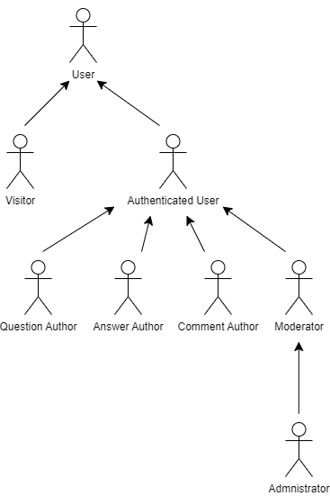
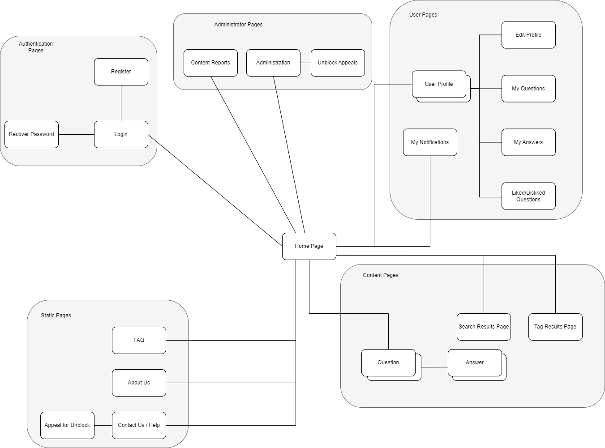
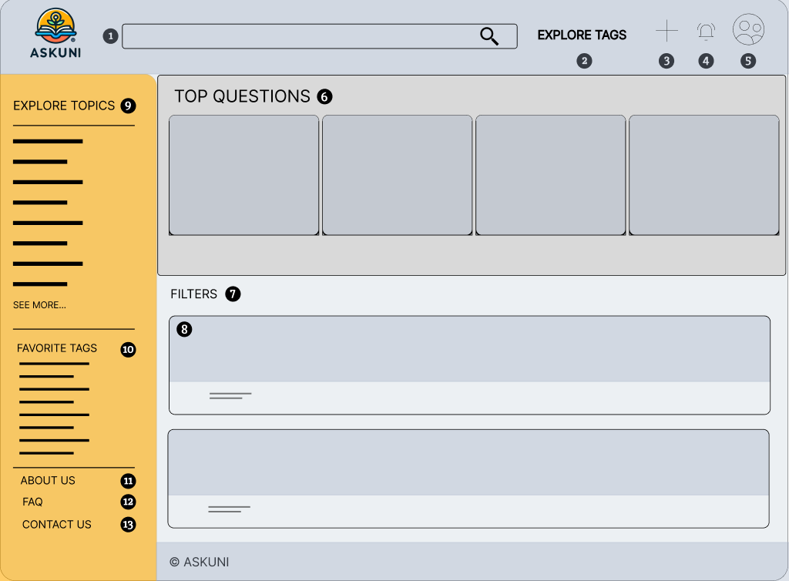
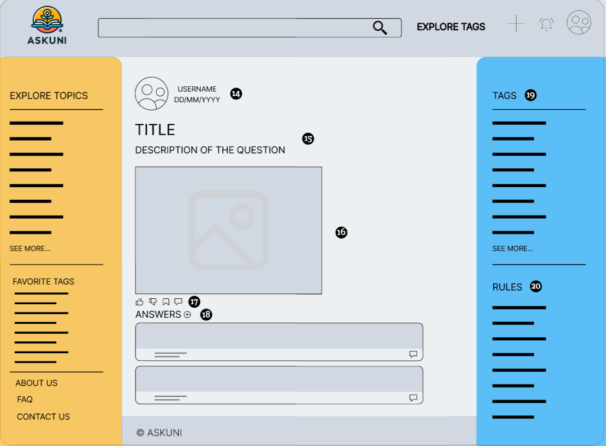

# ER: Requirements Specification Component

> Project vision.

The main vision of AskUni is to create a collaborative platform where students, teachers and researchers can easily share, discuss and exchange ideas and resources on academic subjects. Users can post, comment and engage with content through a simple liking system, promoting a supportive and dynamic academic community.

## A1: AskUni
> Goals, business context and environment.

**AskUni** is a collaborative platform developed for students, teachers and researchers at FEUP. It provides an interactive space where users can share knowledge, ask questions and engage in academic discussions, fostering a vibrant and supportive academic community.

**AskUni** addresses the challenges many students at FEUP face when dealing with unanswered academic questions. The platform serves as a dedicated space where users can post questions, receive answers, share ideas and collaborate on academic topics. By bringing together students, teachers and researchers, **AskUni** has created an academic environment that promotes collective learning and peer-to-peer support.

> Motivation:

The motivation behind **AskUni** stemmed from the experiences of FEUP students who felt isolated when trying to solve difficult academic problems independently. **AskUni** fills this gap by providing a user-friendly web application that facilitates collaboration and knowledge sharing across the academic community.

> Main features:

The primary objective of AskUni is to create an academic space where users can easily ask questions, provide answers and exchange resources. The platform aims to foster collaboration and active participation in discussions, making academic life more interactive and supportive at FEUP. By offering a streamlined interface and intuitive features, AskUni helps students engage with academic content more effectively.

* **AskUni** includes robust authentication features such as **Login/Logout, Registration** and **Password Recovery**. All users must go through a verification process to ensure that they are affiliated with FEUP.

* **Administrators** can manage user accounts, allowing them to **view, edit, delete, block** or **unblock** accounts. This ensures the community remains safe and respectful.

* **Moderators** oversee content quality by editing or deleting inappropriate posts, answers and comments. They also manage reported content to maintain the platform's integrity.

*Both administrators and moderators are active participants in the community, able to post, vote and engage like regular users while maintaining platform order.

* **AskUni** provides a comprehensive search function with both **exact match search** and **full-text search**. Users can easily find specific questions or topics by using tags or keywords.

* **Search results** can be filtered and sorted by popularity or relevance, making it easier to find the most valuable content.

* **Question and Answer System:** Registered users can post questions, provide answers and vote on both. This core feature encourages active participation and collaboration within the academic community.

* **Voting & Commenting:** Users can vote on questions and answers, helping to highlight the most useful content. Comments further support discussion by allowing users to engage in more detailed conversations.

* **Tagging System:** Questions are categorized by tags, making it easier to organize and browse related topics.

* **Personalized Feed:** Authenticated users can follow specific questions, tags or topics with relevant content appearing in their personalized feed.

* **User Profile:** Every user has a profile where they can view and edit their information, including adding a profile picture.

* **Notifications:** Users receive notifications for new answers, votes or when they earn badges, helping them stay engaged.

* **Badging System:** Users are rewarded with badges for specific achievements, motivating active participation.

> User profiles:
   AskUni users are divided into distinct groups, each with different levels of permissions:

* **Visitors:** Non-registered users who can browse and view questions and answers, but cannot participate or interact with the content.

* **Authenticated Users:** Registered users with the ability to fully engage with the platform. They can post questions, provide answers, vote on content, comment on posts and follow tags. Their contributions are tracked, allowing them to build a reputation through scores and badges based on achievements.

* **Moderators:** Users with additional responsibilities to ensure content quality. In addition to the capabilities of authenticated users, moderators can manage questions, answers and comments, deleting inappropriate content. They can also edit question tags and address reported posts.

* **Administrators:** Moderators with full access and control over the platform. They manage user accounts (including creating, editing, deleting and blocking/unblocking users) and handle platform-wide settings, such as managing tags.

To ensure the platform remains accessible and user-friendly, it will be designed with responsiveness in mind, allowing users to access it from various devices such as desktops, tablets and smartphones. 
The goal is to provide an intuitive, enjoyable experience that encourages user participation and supports the exchange of academic knowledge.

---

## A2: Actors and User stories

> The following section provides an overview of the actors, user stories and supplementary requirements for the project.

### 1. Actors

*Figure 1: Actors UML*

| Identifier          | Description                                                                 |
|---------------------|-----------------------------------------------------------------------------|
| User                | Generic user that has access to general information. |
| Visitor             | Unauthenticated user who can browse public content, sign-up or sign-in |
| Authenticated User  | A registered user who can ask questions, post answers, vote, comment and manage their profile. |
| Question Author     | An authenticated user who creates and manages their own questions, including editing and deleting them. |
| Answer Author       | An authenticated user who posts and manages answers, with permissions to edit or delete their answers. |
| Comment Author      | An authenticated user who posts comments on questions or answers, with permissions to edit or delete their comments. |
| Moderator           | An authenticated user with privileges to moderate content, edit question tags and manage reports. |
| Administrator       | A moderator who is also responsible for managing platform settings, overseeing user behavior and handling critical issues. |

*Table 1: AskUni actors description.*

### 2. User Stories

#### 2.1 **Visitor**

| Identifier | Name               | Priority | Description | Responsible Student                                                           |
|------------|--------------------|----------|-------------|-------------------------------------------------------------------------------|
| US01 | Sign Up | High | As a Visitor, I want to create an account, so that I can authenticate into the platform. | Tiago Pinto |
| US02 | Sign In | High | As a Visitor, I want to authenticate into the system, so that I can ask questions and participate. | Tiago Pinto |
| US03 | Recover Password | Medium | As a Visitor, I want to recover my password, so that I can regain access into the platform. | Tiago Pinto |

*Table 2: Visitor User Stories.*

#### 2.2 **User**

| Identifier | Name               | Priority | Description | Responsible Student                                                           |
|------------|--------------------|----------|-------------|-------------------------------------------------------------------------------|
| US04 | View Home Page | High | As a User, I want to view the home page, so that I can start navigating the website. | João Martinho |
| US05 | View Top Questions | High | As a User, I want to view the top questions, so that I can see the most trending questions. | João Martinho |
| US06 | Browse Questions | High | As a User, I want to browse through all questions, so that I can explore various topics of interest. | João Martinho |
| US07 | View Question Details | High | As a User, I want to view the details of a question, so that I can see the full question, answers and comments. | Leonardo Teixeira |
| US08 | Search Questions | High | As a User, I want to search for questions using both exact matches and full-text search, so that I can find specific questions. | Leonardo Teixeira |
| US09 | Browse Questions by Tags | Medium | As a User, I want to browse questions by tags, so that I can filter questions based on subjects of interest. | Leonardo Teixeira |
| US10 | View User Profiles	| Medium | As a User, I want to view other users’ profiles, so that I can see their contributions and score. | Leonardo Teixeira |
| US11 | View About Us Page | Medium | As a User, I want to see the 'About Us' page, so that I can learn more about the platform. | Tiago Pinto |
| US12 | View FAQ Page | Medium | As a User, I want to see the 'FAQ' page, so that I can find answers to common questions about the platform. | João Martinho |
| US13 | Apply Search Filters | Medium | As a User, I want to apply filters to search results, so that I can find the most recent or relevant questions. | João Martinho |
| US14 | Ordering of Search Results | Low | As a User, I want to order search results, so that I can view the results in the most helpful order. | Tiago Pinto |

*Table 3: User User Stories.*

#### 2.3 **Authenticated User**

| Identifier | Name               | Priority | Description | Responsible Student                                                           |
|------------|--------------------|----------|-------------|-------------------------------------------------------------------------------|
| US15 | View Personal Feed | High | As an Authenticated User, I want to view a personalized feed, so that I can see content relevant to my interests and interactions. | Tiago Pinto |
| US16 | Post Question | High | As an Authenticated User, I want to post a question, so that I can seek answers or advice from the community. | Tiago Pinto |
| US17 | Post Answer | High | As an Authenticated User, I want to post answers to questions, so that I can contribute my knowledge and help others. | Tiago Pinto |
| US18 | View My Questions | High | As an Authenticated User, I want to view all the questions I have posted, so that I can track and manage my contributions. | Leonardo Teixeira |
| US19 | View My Answers | High | As an Authenticated User, I want to view all the answers I have posted, so that I can track my engagement with the community. | Leonardo Teixeira |
| US20 | View Profile | High | As an Authenticated User, I want to view my profile, so that I can see my personal information. | Leonardo Teixeira |
| US21 | Edit Profile | High | As an Authenticated User, I want to edit my profile, so that I can keep my information up-to-date. | Leonardo Teixeira |
| US22 | Manage Notifications | High | As an Authenticated User, I want to receive and view my notifications regarding answers to my questions, votes on my content and questions/tags that I follow, so that I can stay updated and improve my experience on the platform. | João Martinho |
| US23 | See Personal Score | High | As an Authenticated User, I want my score to be updated based on votes on my questions and answers, so that I can track my reputation and contributions to the platform. | João Martinho |
| US24 | Log Out | High | As an Authenticated User, I want to log out of my account, so that I can exit the platform safely. | Tiago Pinto |
| US25 | Vote on Questions | Medium | As an Authenticated User, I want to like or dislike questions, so that I can express the quality or relevance of the questions. | João Martinho |
| US26 | Vote on Answers | Medium | As an Authenticated User, I want to like or dislike answers, so that I can promote helpful answers and irrelevant poor ones. | João Martinho |
| US27 | Comment on Questions | Medium | As an Authenticated User, I want to comment on questions, so that I can provide feedback or ask for clarification. | João Martinho |
| US28 | Comment on Answers | Medium | As an Authenticated User, I want to comment on answers, so that I can engage in further discussion or ask for clarification. | João Martinho |
| US29 | Follow Question | Medium | As an Authenticated User, I want to follow a question, so that I can receive updates when new answers or comments are posted. | Tiago Pinto |
| US30 | Follow Tags | Medium | As an Authenticated User, I want to follow specific tags, so that I can stay informed about topics that interest me. | Tiago Pinto |
| US31 | Edit Profile Picture | Medium | As an Authenticated User, I want to upload or change my profile picture, so that I can personalize my account. | Leonardo Teixeira |
| US32 | Delete Account | Medium | As an Authenticated User, I want to delete my account, so that I can remove my personal data and stop using the platform. | Leonardo Teixeira |
| US33 | Contact Support | Low | As an Authenticated User, I want to contact support, so that I seek help when I'm in need. | João Martinho |
| US34 | Report Content | Low | As an Authenticated User, I want to report inappropriate content, so that I can contribute to keeping the platform safe. | João Martinho |
| US35 | See User Badges | Low | As an Authenticated User, I want to earn and view badges, so that I can be recognized for my contributions to the platform. | Leonardo Teixeira |
| US36 | Badge Notifications | Low | As an Authenticated User, I want to receive a notification when I am awarded a badge, so that I can be reminded of my achievements. | Leonardo Teixeira |
| US37 | Appeal for Unblock | Low | As an Authenticated User, I want to submit an appeal if my account is blocked, so that I can regain access to the platform. | João Martinho |

*Table 4: Authenticated User Stories.*

#### 2.4 **Question Author**

| Identifier | Name               | Priority | Description | Responsible Student                                                           |
|------------|--------------------|----------|-------------|-------------------------------------------------------------------------------|
| US38 | Edit Question | High | As a Question Author, I want to edit my question, so that I can improve clarity or correct any mistakes. | João Martinho |
| US39 | Delete Question | High | As a Question Author, I want to delete my question, so that I can remove it if it's no longer relevant. | João Martinho |
| US40 | Edit Question Tags | Medium | As a Question Author, I want to edit the tags of my question, so that it can be categorized correctly. | Leonardo Teixeira |
| US41 | Mark Answer as Correct | Medium | As a Question Author, I want to mark an answer as correct, so that others know the most helpful solution. | Leonardo Teixeira |

*Table 5: Question Author User Stories.*

#### 2.5 **Answer Author**

| Identifier | Name               | Priority | Description | Responsible Student                                                           |
|------------|--------------------|----------|-------------|-------------------------------------------------------------------------------|
| US42 | Edit Answer | High | As an Answer Author, I want to edit my answer, so that I can improve clarity or correct any mistakes. | Tiago Pinto |
| US43 | Delete Answer | High | As an Answer Author, I want to delete my answer, so that I can remove it if it's no longer relevant. | Leonardo Teixeira |

*Table 6: Answer Author User Stories.*

#### 2.6 **Comment Author**

| Identifier | Name               | Priority | Description | Responsible Student                                                           |
|------------|--------------------|----------|-------------|-------------------------------------------------------------------------------|
| US44 | Edit Comment | Medium | As a Comment Author, I want to edit my comment, so that I can improve clarity or correct any mistakes. | Tiago Pinto |
| US45 | Delete Comment | Medium | As a Comment Author, I want to delete my comment, so that I can remove it if it's no longer relevant. | Tiago Pinto |

*Table 7: Comment Author User Stories.*

#### 2.7 **Moderator**

| Identifier | Name               | Priority | Description | Responsible Student                                                           |
|------------|--------------------|----------|-------------|-------------------------------------------------------------------------------|
| US46 | Delete Content | Medium | As a Moderator, I want to delete inappropriate content, so that I can maintain a respectful environment on the platform. | João Martinho |
| US47 | Edit Question Tags | Medium | As a Moderator, I want to edit question tags, so that I can ensure questions are categorized correctly. | João Martinho |
| US48 | Manage Content Reports | Low | As a Moderator, I want to manage content reports, so that I can take appropriate actions on reported content. | Tiago Pinto |

*Table 8: Moderator User Stories.*

#### 2.8 **Administrator**

| Identifier | Name               | Priority | Description | Responsible Student                                                           |
|------------|--------------------|----------|-------------|-------------------------------------------------------------------------------|
| US49 | Administer User Accounts | High | As an Admin, I want to search, view, edit and create user accounts, so that I can effectively manage users on the platform. | Leonardo Teixeira |
| US50 | Block and Unblock User Accounts | Medium | As an Admin, I want to block and unblock user accounts, so that I can maintain a safe environment. | Leonardo Teixeira |
| US51 | Delete User Account | Medium | As an Admin, I want to delete user accounts, so that I can remove accounts that violate terms of service or are inactive. | Leonardo Teixeira |
| US52 | Manage Tags | Medium | As an Admin, I want to manage tags, so that I can ensure relevant topics are available for users to browse. | Tiago Pinto |
| US53 | Manage FAQ | Medium |  As an Admin, I want to manage FAQs, so that I can provide accurate and helpful information to users. | Tiago Pinto |

*Table 9: Administrator User Stories.*

### 3. Supplementary Requirements

#### 3.1. Business rules

| Identifier | Name                  | Description                                                                                 |
|------------|-----------------------|---------------------------------------------------------------------------------------------|
| BR01 | Account Deletion Anonymity | Upon account deletion, shared user data (e.g., questions, answers, likes) is kept but is made anonymous. |
| BR02 | Admin/Mod Participation | Administrators and Moderators are participating members of the community, meaning they can post or vote on questions or answers. |
| BR03 | Edit Indication for Questions | Questions and answers edited after being posted should have a clear indication of the edits made. |
| BR04 | User Badges Criteria | User badges are dependent on the likes and dislikes received on their questions and answers, as well as user actions. |
| BR05 | Unique Email | Each user must register with a unique email address, ensuring that no two accounts can share the same email. |
| BR06 | Unique Username | Each user must have a unique username, preventing duplication and ensuring user identity in the community. |
| BR07 | FEUP Email Association | Each user must register with an email in the form '@fe.up.pt', ensuring association with FEUP. |
| BR08 | Self-Interaction | Users are allowed to comment and vote on their own questions or answers. |
| BR09 | Dates | The date of every question/answer/comment must be always less than or equal to the current date |

*Table 10: AskUni Business Rules.*

#### 3.2. Technical requirements

| Identifier | Name                 | Description                                                                                  |
|------------|----------------------|----------------------------------------------------------------------------------------------|
| TR01 | Availability | The system should ensure at least 99% availability over every 24-hour period. |
| TR02 | Performance | The system must ensure response times shorter than 2 seconds to maintain user engagement. |
| TR03 | Robustness  | The system must be designed to handle runtime errors gracefully and continue operating without interruption. |
| TR04 | Scalability | The system must be capable of accommodating a growing number of users and their interactions. |
| TR05 | Accessibility | The system must ensure that all pages are accessible to all users, regardless of disabilities or browser preferences. |
| **TR06** | **Usability** | **The system should be simple and intuitive to use, ensuring that users can easily navigate and interact with the platform. This is very important for AskUni, as it will serve users with varying levels of technical expertise. A user-friendly experience will encourage engagement and ensure satisfaction when using the application.** |
| TR07 | Web Application | The platform must be built as a web application featuring dynamic pages, using technologies such as HTML5, JavaScript, CSS3 and PHP. |
| **TR08** | **Portability** | **The server-side system must be compatible with various operating systems such as Linux, macOS, Windows and others. This capability enhances the deployment options for AskUni, ensuring it can be hosted in different environments based on user needs and infrastructure.** |
| TR09 | Database | The system must use PostgreSQL version 11 or higher, ensuring reliable data storage and management. |
| **TR10** | **Security** | **The system must use an authentication and access control mechanism to prevent unauthorized access to user data. This is essential for AskUni to protect sensitive user information and maintain user trust, ensuring a safe environment for discussions and interactions.** |
| TR11 | Ethics | The system must adhere to ethical guidelines in software development, guaranteeing that personal user information and usage data are only collected or shared with the user's clear consent and understanding. |

*Table 11: AskUni Technical Requirements*

#### 3.3. Restrictions

| Identifier | Name                  | Description                                                                                 |
|------------|-----------------------|---------------------------------------------------------------------------------------------|
| R01 | Database | The system must use PostgreSQL for data management. |
| R02 | Deadline | The system should be ready to be used by the end of the semester. |

*Table 12: AskUni Project Restrictions*

---

## A3: Information Architecture

> This artifact includes a sitemap along with two wireframes to provide a representation of AskUni's pages and the design style implemented.

### 1. Sitemap

> AskUni consists of several categories of pages, including authentication, content, user, administration and static pages.

*Figure 2: AskUni Sitemap*

### 2. Wireframes

> The images below display the wireframes for both the Home Page and the Question Page.

#### UI01: Home Page

{width=768 height=566}

*Figure 3: AskUni Home Page Wireframe*

1. Search Bar
2. Explore Tags Option
3. Create New Question
4. Notifications Hub
5. Profile Page
6. Top Questions Section
7. Filters Option 
8. Questions Related to the Applied Filters
9. Topics Section
10. User’s Favorite Tags
11. About Us Page
12. FAQ Page
13. Contact Us/Help Page

#### UI02: Question Page

{width=769 height=567}

*Figure 4: AskUni Question Page Wireframe*

14. Information about the Question’s Publisher and Date of Publication
15. Title and Description of the Question 
16. Question’s image (If Applicable) 
17. Options to Like, Dislike, Save and Comment on the Question
18. Answers to the Existing Question 
19. Question’s Tags
20. General Rules of the Website

---

## Revision history

* Changes made to the first submission:
* Create Er 24/09/2024
* Start A1 24/09/2024
* Finish A1, A2 5/10/2024
* Finish A3 5/10/2024
* Revision and added some corrections to A2 and A3 6/10/2024

---

GROUP153, 24/09/2024

* Tiago Pinto, up202206280@up.pt (Editor)
* Leonardo Teixeira, up202208726@up.pt 
* João Martinho, up202204883@up.pt 

