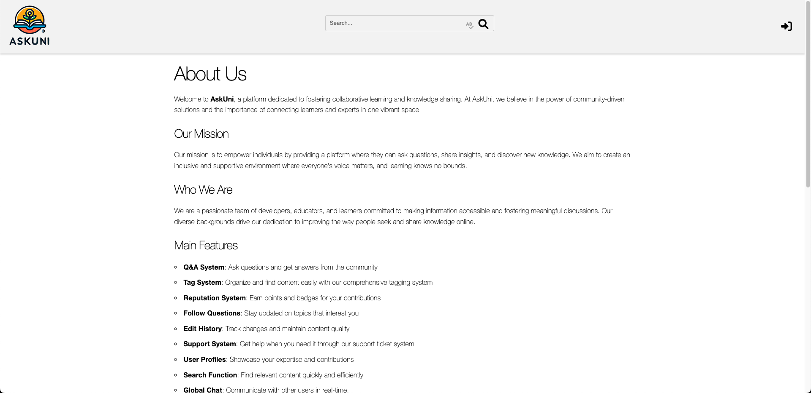
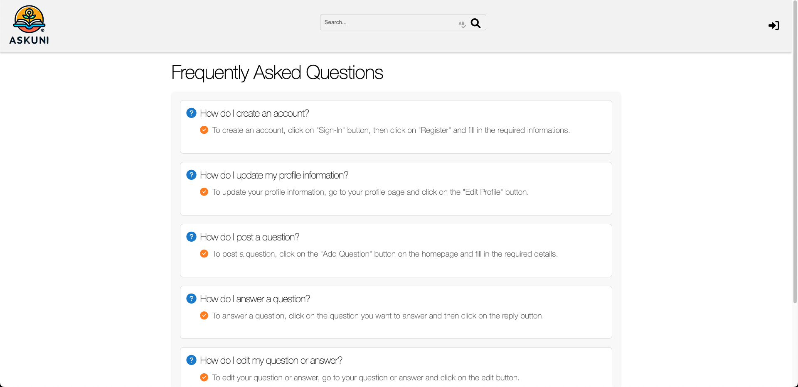
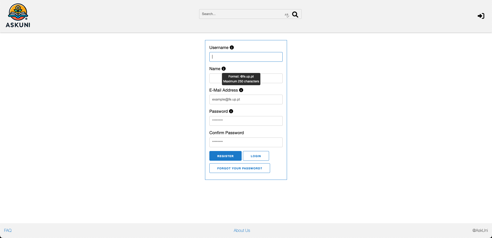
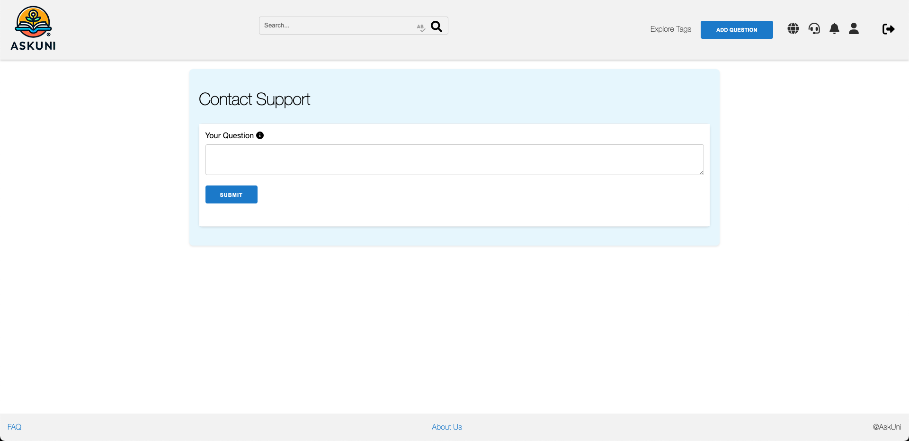
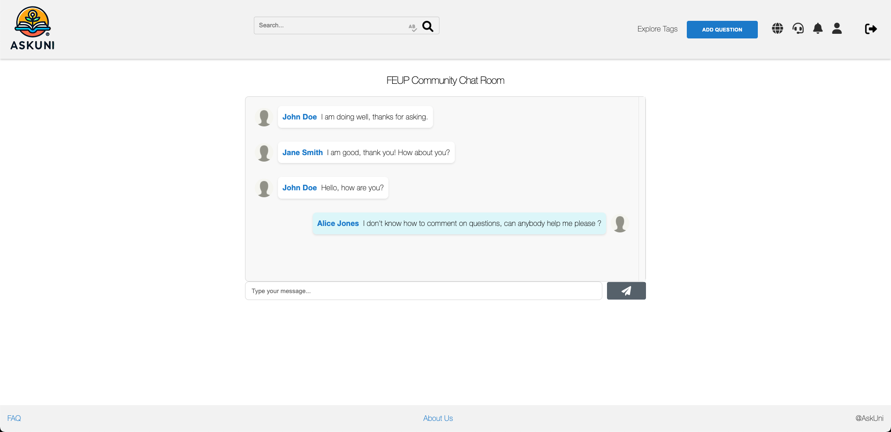
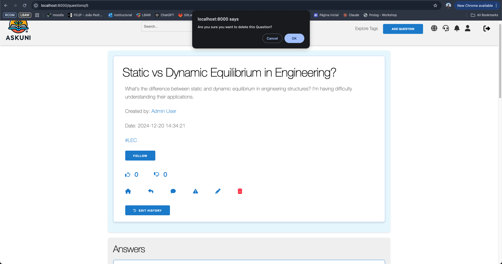
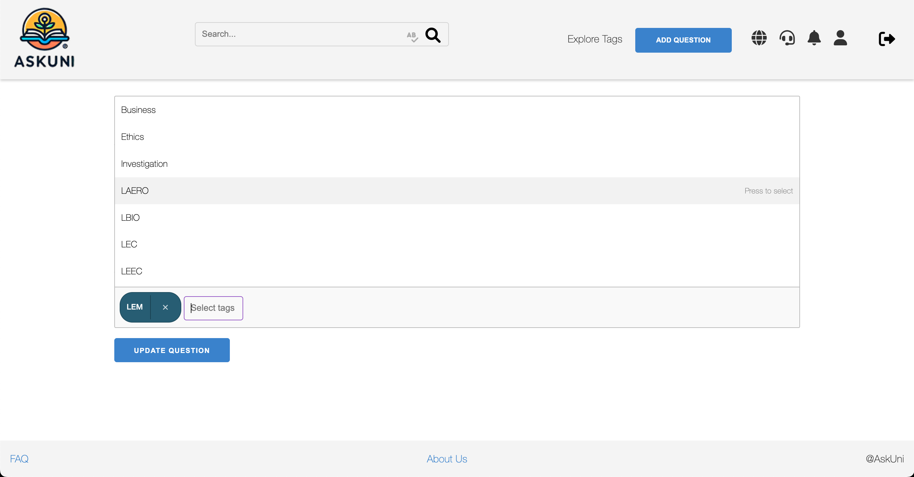
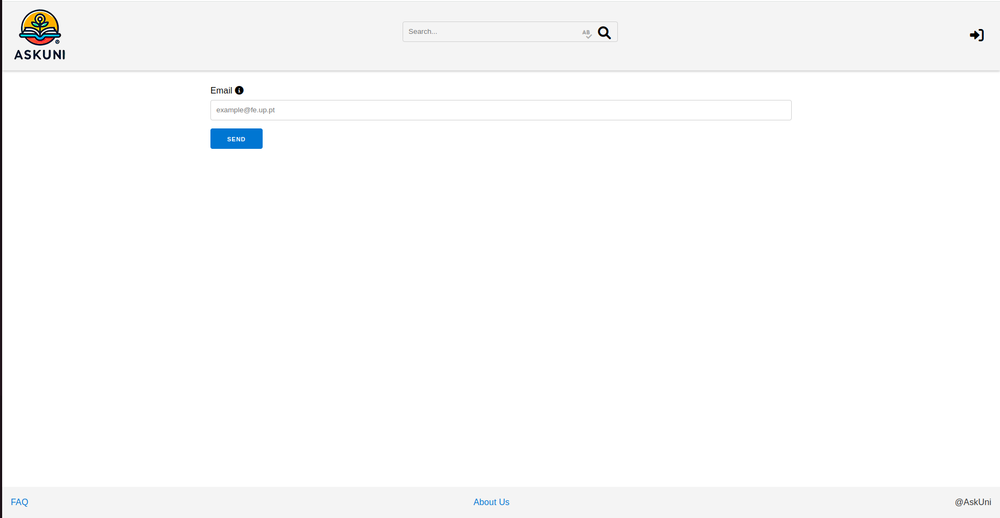
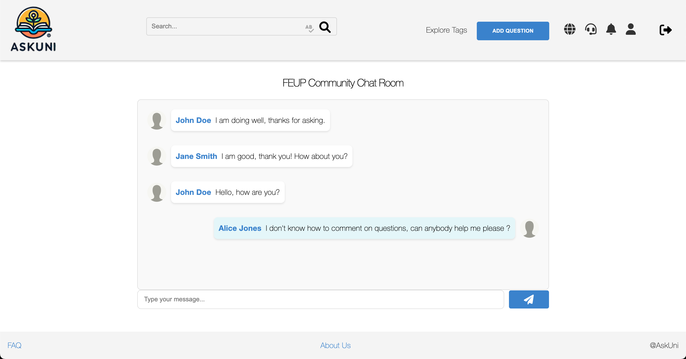
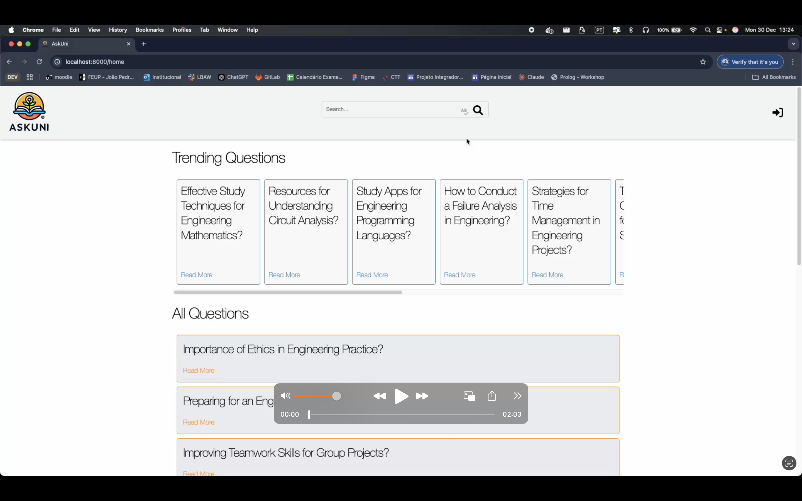

# PA: Product and Presentation

The main vision of AskUni is to create a collaborative platform where students, teachers and researchers can easily share, discuss and exchange ideas and resources on academic subjects. Users can post, comment and engage with content through a simple liking system, promoting a supportive and dynamic academic community.

## A9: Product

AskUni is an innovative and collaborative web platform tailored specifically for the academic community at FEUP. It provides a dynamic space where students, teachers, and researchers can interact by asking questions, sharing answers, and engaging in meaningful academic discussions. The platform was developed to address a key challenge faced by many students: the lack of a centralised, supportive environment to seek help with academic problems. By fostering collaboration and collective learning, AskUni bridges this gap and encourages an inclusive academic culture.

At its core, AskUni features a user-friendly question-and-answer system complemented by voting, commenting, and tagging functionalities, enabling users to find, engage with, and contribute valuable academic content efficiently. The platform offers a personalised feed, allowing users to follow specific topics, questions, or tags that align with their interests. Users can build their profiles, track their contributions, and earn badges as recognition for their achievements, promoting active participation and rewarding engagement.

To maintain a safe and respectful environment, AskUni implements a robust authentication system that verifies users as members of the FEUP community. Roles within the platform include visitors, authenticated users, moderators, and administrators. Moderators ensure the quality of content by managing inappropriate posts and handling reported issues, while administrators oversee user accounts and platform settings. Both roles actively participate in discussions to maintain an engaging and well-governed community.

The platform also incorporates advanced features such as a comprehensive search system with full-text and tag-based search, filters for relevance and popularity, and notifications to keep users updated on new interactions or achievements. Designed with responsiveness in mind, AskUni ensures seamless access from any device, whether desktop, tablet, or smartphone, providing an intuitive and enjoyable experience.

By creating a centralized space for academic collaboration, AskUni enhances the way knowledge is shared and fosters a supportive academic environment, making it an essential tool for students, teachers, and researchers at FEUP. 

### 1. Installation

You can find the prototype Docker image in GitLab's Container Registry, ready to be launched with the following command:
```bash
docker run -d --name lbaw24153 -p 8001:80 gitlab.up.pt:5050/lbaw/lbaw2425/lbaw24153
```

The prototype will be available at localhost:8001 <br>
The code is available at: https://gitlab.up.pt/lbaw/lbaw2425/lbaw24153 <br>
The PA tag is available at: https://gitlab.up.pt/lbaw/lbaw2425/lbaw24153/-/tags/PA

### 2. Usage

#### 2.1. Administration Credentials

| Email | Password |
| -------- | -------- |
| admin_user@fe.up.pt    | hashed_password_admin |

Table 1: AskUni Administration Credentials

#### 2.2. User Credentials

| Type          | Email  | Password |
| ------------- | --------- | -------- |
| Moderator | jane_smith@fe.up.pt  | hashed_password_2 |
| Regular User   | alice_jones@fe.up.pt   | hashed_password_3 |
| Blocked User| john_doe@fe.up.pt|1234|

Table 2: AskUni User Credentials

#### 2.3. MailTrap Credentials

| Email | Password |
|-------|----------|
| lbaw24153@gmail.com | 4RiaZjJEmNY9C@c |

Table 3: MailTrap Credentials

#### 2.4. Google Email Credentials

| Email | Password |
|-------|----------|
| lbaw24153@gmail.com | 4RiaZjJEmNY9C@c |

table 4: Google Email Credentials

### 3. Application Help

When looking for help, users can explore various options, such as:

* **About Us Page**, where users can have a better insight into what AskUni is all about and access our contact information.



* **FAQ Page**, a section dedicated to providing clear answers to common questions about AskUni.



* **Contextual Help** to clarify the requirements and constraints for the user.



* **Contact Support** functionality, enabling users to directly ask questions to the page administrators.


* **FEUP Community Chat Room**, where users can ask questions and receive answers form any other user, enabling quicker responses.



### 4. Input Validation

User input was validated using multiple techniques, both on the client-side and server-side.


On the client-side, JavaScript was utilised to validate the correct format and enforce constraints. For example, in the registration form:

```javascript
const registerForm = document.getElementById('registerForm');
if (registerForm) {
    registerForm.addEventListener('submit', function(event) {
        let username = document.getElementById('username').value;
        let name = document.getElementById('name').value;
        let email = document.getElementById('email').value;
        let password = document.getElementById('password').value;
        let confirmPassword = document.getElementById('password-confirm').value;

        if (username === "") {
            alert("Username must be filled out");
            event.preventDefault();
        }
        if (name === "") {
            alert("Name must be filled out");
            event.preventDefault();
        }
        if (email === "") {
            alert("Email must be filled out");
            event.preventDefault();
        }
        if (!email.endsWith("@fe.up.pt")) {
            alert("Email must be in the format @fe.up.pt");
            event.preventDefault();
        }
        if (password === "") {
            alert("Password must be filled out");
            event.preventDefault();
        }
        if (password.length < 8) {
            alert("Password must be at least 8 characters long");
            event.preventDefault();
        }
        if (password !== confirmPassword) {
            alert("Passwords do not match");
            event.preventDefault();
        }
    });
}

```

Also on the client-side, we use the default JavaScript confirmation prompt (confirm()) to ask the user for confirmation before performing critical actions, such as deleting a Question: 



Now on the server-side, we used the laravel validator by using "Iluminate\Http\Request" to ensure that the user input meets the required constraints and is properly validated before being processed. For example, when updating an existing Question:

```php
public function update(Request $request, Question $question)
{
$this->authorize('update', $question);

$request->validate([
'title' => 'required|string|max:255',
'content' => 'required|string',
'tags' => 'array|max:5',
'tags.*' => 'integer|exists:tags,id',
]);

$question->update([
'title' => $request->title,
]);

$question->post->update([
'content' => $request->input('content'),
]);

$question->tags()->sync($request->input('tags', []));

return redirect()->route('questions.show', $question->posts_id)->with('success', 'Question updated successfully');
}
```

### 5. Check Accessibility and Usability

The accessibility and usability checklists are available at the following links:

[Accessibility Checklist](https://gitlab.up.pt/lbaw/lbaw2425/lbaw24153/-/blob/main/docs/checklist_acessibilidade.pdf?ref_type=heads): 15/18

[Usability Checklist](https://gitlab.up.pt/lbaw/lbaw2425/lbaw24153/-/blob/main/docs/Checklist%20de%20Usabilidade%20-%20SAPO%20UX.pdf?ref_type=heads): 24/28

### 6. HTML & CSS Validation

The HTML and CSS validation results are available at the following links:

[HTML Validation](https://gitlab.up.pt/lbaw/lbaw2425/lbaw24153/-/blob/main/docs/validacao_html.pdf?ref_type=heads)

[CSS Validation](https://gitlab.up.pt/lbaw/lbaw2425/lbaw24153/-/blob/main/docs/validacao_css.pdf?ref_type=heads)


### 7. Revisions to the Project

Since the initial project specification, we made some changes, such as:
* Removed tables **_super_tags_** and **_users_join_super_tags_** and added tables **_frequently_asked_questions_**, **_support_questions_**, **_support_answers_** and **_chat_messages_**.
* Included some additional indexes for **_tags_id_idx_**, **_posts_tags_posts_id_idx_**, **_posts_tags_tags_id_idx_**, and **_posts_tags_posts_id_tags_id_idx_**.
* Removed some indexes that were not efficient or beneficial for performance.
* Included some additional triggers for timestamp formatting and maintaining edit history.
* Introduced a **_Support Ticket System_**, which allows direct communication between regular user and the administration of the page.
* Introduced a **_Global Chat_** feature, allowing real-time communication between users
 
<br>
[OpenAPI documentation](https://gitlab.up.pt/lbaw/lbaw2425/lbaw24153/-/blob/main/openapi/a9_openapi.yaml?ref_type=heads)


### 8. Implementation Details

#### 8.1. Libraries Used

In the development of the project we used different libraries and frameworks:

* [Laravel](https://laravel.com/)
  * Used as the main framework for the backend of our project, managing routes, controllers, models, validations and more.

* [Font Awesome](https://fontawesome.com/)
  * Used to add icons to buttons, to simplify and improve the visuals of our page
  * Example: Like button on [Question Page](https://gitlab.up.pt/lbaw/lbaw2425/lbaw24153/-/blob/main/resources/views/pages/questions/show.blade.php?ref_type=heads)
    ```html
    <button class="btn btn-like like-btn btn-like-active" data-post-id="{{ $question->posts_id }}">
           <i class="fas fa-thumbs-up"></i> <span class="like-count">{{ $question->post->likesCount() }}</span>
    </button>
    ```

* [Choices.js](https://choices-js.github.io/Choices/)
  * Used to enhance the user experience by allowing easy addition and removal of tags in a clean and intuitive interface.
  * Example: [Edit Question](https://gitlab.up.pt/lbaw/lbaw2425/lbaw24153/-/blob/main/resources/views/pages/editQuestion.blade.php?ref_type=heads) form
  

* [Mailtrap.io](https://mailtrap.io/)
   * Used for the recover password feature.
   * Example: Recover the password when your forgot your current password, you should submit your email in the [reset page](https://gitlab.up.pt/lbaw/lbaw2425/lbaw24153/-/blob/main/resources/views/emails/form.blade.php)

* [Pusher](https://pusher.com/)
  * Used to implement our real-time **_Feup Community Chat_**
  * Example: [Chat](https://gitlab.up.pt/lbaw/lbaw2425/lbaw24153/-/blob/main/resources/views/pages/chat/index.blade.php?ref_type=heads) page 
  
  

#### 8.2 User Stories
 

| US Identifier | Name    | Module | Priority                       | Team Members               | State  |
| ------------- | ------- | ------ | ------------------------------ | -------------------------- | ------ |
| **US02** | Sign In | M01: Authentication | High | **Tiago Pinto** | 100% |
| **US24** | Log Out | M01: Authentication | High | **Tiago Pinto** | 100% |
| **US04** | View Home Page | M03: Navigation and Browsing | High | **João Martinho** | 100% |
| **US05** | View Top Questions | M03: Navigation and Browsing | High | **João Martinho** | 100% |
| **US20** | View Profile | M02: Individual Profile | High | **Leonardo Teixeira** | 100% |
| **US10** | View User Profiles | M03: Navigation and Browsing | Medium | **Leonardo Teixeira** | 100% |
| **US18** | View My Questions | M02: Individual Profile | High | **Leonardo Teixeira** | 100% |
| **US19** | View My Answers | M02: Individual Profile | High | **Leonardo Teixeira** | 100% |
| **US23** | See Personal Score | M02: Individual Profile | High | **Leonardo Teixeira** | 100% |
| **US01** | Sign Up | M01: Authentication | High | **Tiago Pinto** | 100% |
| **US16** | Post Question | M04: Posts | High | **Tiago Pinto** | 100% |
| **US06** | Browse Questions | M03: Navigation and Browsing | High | **João Martinho** | 100% |
| **US21** | Edit Profile | M02: Individual Profile | High | **Leonardo Teixeira** | 100% |
| **US31** | Edit Profile Picture | M02: Individual Profile | Medium | **Leonardo Teixeira** | 100% |
| **US38** | Delete Question | M04: Posts | High | **João Martinho** | 100% |
| **US39** | Edit Question | M04: Posts | High | **João Martinho** | 100% |
| **US07** | View Question Details | M04: Posts | High | **Tiago Pinto** | 100% |
| **US17** | Post Answer | M04: Posts | High | **Tiago Pinto** | 100% |
| **US15** | View Personal Feed | M03: Navigation and Browsing | High | **João Martinho** | 100% |
| **US22** | Manage Notifications | M06: Notifications and Interactions | High | **Leonardo Teixeira** | 100% |
| **US42** | Edit Answer | M04: Posts | High | **João Martinho** | 100% |
| **US43** | Delete Answer | M04: Posts | High | **João Martinho** | 100% |
| **US49** | Administer User Accounts | M07: Administration | High | **Tiago Pinto** | 100% |
| **US32** | Delete Account | M02: Individual Profile | Medium | **Tiago Pinto** | 100% |
| **US51** | Delete Account | M07: Administration | Medium | **Tiago Pinto** | 100% |
| **US08** | Search Questions | M03: Navigation and Browsing | High | **Leonardo Teixeira** | 100% |
| **US35** | See User Badges | M02: Individual Profile | Low | **Leonardo Teixeira** | 100% |
| **US36** | Badge Notifications | M06: Notifications and Interactions | Low | **Leonardo Teixeira** | 100% |
| **US27** | Comment on Questions | M05: Comments | Medium | **João Martinho** | 100% |
| **US28** | Comment on Answers | M05: Comments | Medium | **João Martinho** | 100% |
| **US44** | Edit Comment | M05: Comments | Medium | **João Martinho** | 100% |
| **US45** | Delete Comment | M05: Comments | Medium | **João Martinho** | 100% |
| **US14** | Ordering of Search Results | M03: Navigation and Browsing | Low | **Leonardo Teixeira** | 100% |
| **US25** | Vote on Questions | M06: Notifications and Interactions | Medium | **João Martinho** | 100% |
| **US26** | Vote on Answers | M06: Notifications and Interactions | Medium | **Tiago Pinto** | 100% |
| **US09** | Browse Questions by Tags | M03: Navigation and Browsing | Medium | **Leonardo Teixeira** | 100% |
| **US12** | View FAQ Page | M03: Navigation and Browsing | Medium | **João Martinho** | 100% |
| **US40** | Edit Question Tags | M04: Posts | Medium | **Leonardo Teixeira** | 100% |
| **US13** | Manage FAQ | M08: Support, FAQs, and Contacts | Medium | **João Martinho** | 100% |
| **US03** | Recover Password | M11: Appeals and Password Reset | Medium | **Tiago Pinto** | 100% |
| **US30** | Follow Tags | M06: Notifications and Interactions | Medium | **Leonardo Teixeira** | 100% |
| **US29** | Follow Question | M06: Notifications and Interactions | Medium | **Leonardo Teixeira** | 100% |
| **US34** | Report Content | M04: Posts | Low | **João Martinho** | 100% |
| **US11** | View About Us Page | M03: Navigation and Browsing | Medium | **Tiago Pinto** | 100% |
| **US33** | Contact Support | M08: Support, FAQs, and Contacts | Low | **João Martinho** | 100% |
| **US52** | Manage Tags | M09: Tags | Medium | **Leonardo Teixeira** | 100% |
| **US37** | Appeal for Unblock | M11: Appeals and Password Reset | Low | **Tiago Pinto** | 100% |
| **US41** | Mark Answer as Correct | M04: Posts | Medium | **Leonardo Teixeira** | 100% |
| **US50** | Block and Unblock User Accounts | M07: Administration | Medium | **Tiago Pinto** | 100% |
| **US46** | Delete Content | M07: Administration | Medium | **Tiago Pinto** | 100% |
| **US47** | Edit Question Tags | M09: Tags | Medium | **Tiago Pinto** | 100% |
| **US48** | Manage Content Reports | M07: Administration | Low | **Tiago Pinto** | 100% |
| **US53** | Contextual Help in Forms | M03: Navigation and Browsing | Medium | **Leonardo Teixeira** | 100% |
| **US54** | Community Chat | M12: Chat | Low | **Leonardo Teixeira** | 100% |
| **US55** | Manage About Us Page | M07: Administration | Medium | **Tiago Pinto** | 100% |
| **US56** | My Votes Profile Section | M02: Individual Profile | Medium | **João Martinho** | 100% |
| **US57** | My Comments Profile Section | M02: Individual Profile | Medium | **João Martinho** | 100% |
| **US58** | My Support Questions Profile Section | M02: Individual Profile | Medium | **João Martinho** | 100% |
| **US59** | Edit History | M10: Edit History | Medium | **Leonardo Teixeira** | 100% |


---


## A10: Presentation
 
Presentation artifact is designed to showcase the final product developed by the group. It consists of two main components:

**Product Presentation**: A concise written overview of the product and its key features. This section aims to provide a clear and succinct introduction to the product, highlighting its primary functionalities and benefits.

**Video Presentation**: A short video demonstrating the product in action. The video serves as a visual and dynamic representation of the product, allowing viewers to see its features and usability firsthand.

### 1. Product presentation

AskUni is a Q&A platform specifically designed for students and professionals at FEUP. The platform allows users to ask questions, provide answers, follow topics of interest, and collaborate with the community. With a focus on enhancing the learning experience, AskUni offers a structured environment where users can easily find and share knowledge related to their academic and professional fields.

Key features of AskUni include a robust tagging system for organizing content, a reputation system with points and badges to incentivize participation, and a comprehensive search function for quickly finding relevant information. Users can also track changes through the edit history, receive updates on followed questions, and communicate in real-time via the global chat. Additionally, the platform supports user profiles to showcase expertise and contributions, and a support ticket system to assist with any issues.

You can find the prototype Docker image in GitLab's Container Registry, ready to be launched with the following command:

docker run -d --name lbaw24153 -p 8001:80 gitlab.up.pt:5050/lbaw/lbaw2425/lbaw24153   <br>

The prototype will be available at localhost:8001 

### 2. Video presentation

Video Screenshot:


[Video Link](../docs/lbaw24153.mp4)


---


## Revision history

Changes made to the first submission:
* Create PA 21/12/2024
* Start A9 22/12/2024
* Finish A9 22/12/2024
* Start A10 22/12/2024
* Finish A10 01/01/2025

***
GROUP24153, 01/01/2025

* Tiago Pinto, up202206280@up.pt
* Leonardo Teixeira, up202208726@up.pt 
* João Martinho, up202204883@up.pt (Editor)